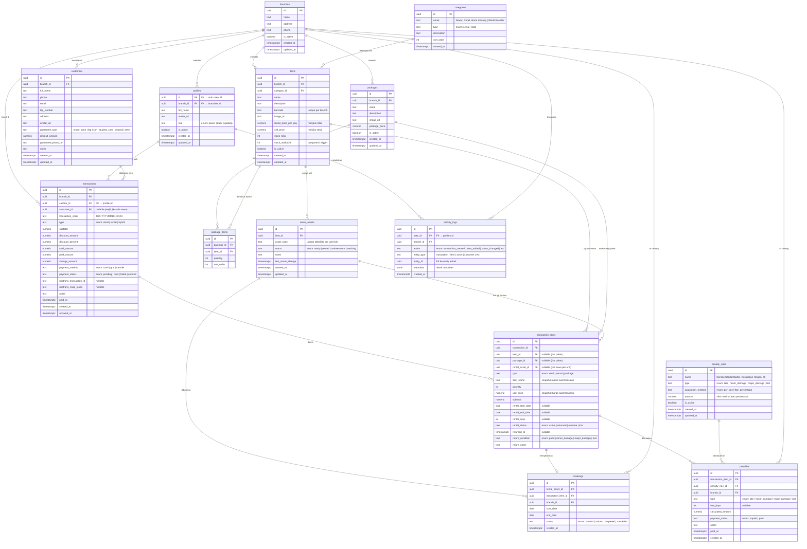

# BotaniRent — Rencana Implementasi Lengkap

> Sistem Manajemen Rental & Retail Outdoor  
> Stack: SvelteKit 2 + Svelte 5 + Tailwind CSS v4 + Supabase + Midtrans

---

## 1. Ringkasan Proyek

BotaniRent adalah aplikasi web POS dan manajemen inventaris terpadu **berbasis multi-cabang** untuk toko outdoor. Sistem ini menangani transaksi hybrid (sewa + jual), kalender booking, denda dinamis, dan integrasi pembayaran cashless melalui Midtrans.

**Tech Stack yang sudah ter-setup:**

- SvelteKit `^2.57.0` dengan Svelte `^5.55.2` (runes mode)
- Tailwind CSS `^4.2.2` via `@tailwindcss/vite`
- Adapter Auto (akan diganti ke `adapter-vercel` untuk production)
- ESLint + Prettier sudah terkonfigurasi

---

## 2. User Review Required

> [!IMPORTANT]
> **Pilihan Adapter Deployment**: PRD menyebutkan deploy ke **Vercel**. Saat ini project menggunakan `adapter-auto`. Apakah ingin langsung diganti ke `@sveltejs/adapter-vercel`?

> [!IMPORTANT]
> **Supabase Project**: Apakah project Supabase sudah dibuat? Saya membutuhkan:
>
> - Supabase Project URL
> - Supabase Anon Key (public)
> - Untuk membuat migration SQL dan setup RLS

> [!WARNING]
> **Midtrans Integration**: Integrasi Midtrans membutuhkan `Server Key` dan `Client Key`. Apakah sudah memiliki akun Midtrans (sandbox/production)?

> [!IMPORTANT]
> **Apakah ingin menggunakan TypeScript (`.ts`)** atau tetap JavaScript (`.js`)? Project saat ini menggunakan `jsconfig.json`. Rekomendasi saya adalah **TypeScript** untuk type safety yang lebih baik, terutama untuk integrasi Supabase yang bisa auto-generate types.

---

## 3. Open Questions

1. **Multi-role per user?** — Apakah seorang user bisa memiliki lebih dari satu role (misal: Kasir sekaligus Admin Gudang)?
2. **Deposit Jaminan** — Apakah deposit jaminan penyewa perlu dilacak sebagai transaksi keuangan terpisah?
3. **Offline Support** — Apakah aplikasi POS perlu bisa berjalan offline/saat internet mati?
4. **Barcode Format** — Format barcode apa yang digunakan? (EAN-13, Code128, QR Code, atau custom?)
5. **Multi-currency** — Apakah semua transaksi dalam Rupiah (IDR) saja?

---

## 4. Struktur Folder (Best Practice SvelteKit 2 + Svelte 5)

```
botanirent-web/
├── .env                            # Environment variables (PRIVATE)
├── .env.example                    # Template env untuk tim
├── svelte.config.js
├── vite.config.js
├── package.json
├── tailwind.config.js              # (opsional, Tailwind v4 pakai CSS-first)
│
├── static/                         # Static assets
│   ├── favicon.ico
│   ├── images/
│   │   ├── logo-botanirent.svg
│   │   ├── login-bg.webp
│   │   └── empty-states/           # Ilustrasi empty state
│   └── fonts/                      # Self-hosted fonts (optional)
│
├── supabase/                       # Supabase local dev & migrations
│   ├── config.toml
│   ├── migrations/                 # SQL migration files
│   │   ├── 001_create_branches.sql
│   │   ├── 002_create_profiles.sql
│   │   ├── 003_create_categories.sql
│   │   ├── 004_create_inventory.sql
│   │   ├── 005_create_assets.sql
│   │   ├── 006_create_packages.sql
│   │   ├── 007_create_customers.sql
│   │   ├── 008_create_transactions.sql
│   │   ├── 009_create_penalties.sql
│   │   ├── 010_create_activity_logs.sql
│   │   └── 011_create_rls_policies.sql
│   ├── functions/                  # Supabase Edge Functions (Deno)
│   │   ├── midtrans-create-payment/
│   │   │   └── index.ts
│   │   └── midtrans-webhook/
│   │       └── index.ts
│   └── seed.sql                    # Seed data untuk development
│
├── src/
│   ├── app.html                    # HTML shell
│   ├── app.css                     # Global CSS + Tailwind imports + Design Tokens
│   ├── app.d.ts                    # Global TypeScript declarations
│   ├── hooks.server.js             # Server hooks (auth guard, Supabase client)
│   ├── hooks.client.js             # Client hooks (error handling)
│   │
│   ├── lib/
│   │   ├── index.js                # Barrel exports ($lib alias)
│   │   │
│   │   ├── components/
│   │   │   ├── ui/                 # 🎨 Reusable UI primitives (Design System)
│   │   │   │   ├── Button.svelte
│   │   │   │   ├── Input.svelte
│   │   │   │   ├── Select.svelte
│   │   │   │   ├── Modal.svelte
│   │   │   │   ├── Card.svelte
│   │   │   │   ├── Badge.svelte
│   │   │   │   ├── Table.svelte
│   │   │   │   ├── Tabs.svelte
│   │   │   │   ├── Toast.svelte
│   │   │   │   ├── SearchBar.svelte
│   │   │   │   ├── DatePicker.svelte
│   │   │   │   ├── Dropdown.svelte
│   │   │   │   ├── Toggle.svelte
│   │   │   │   ├── Stepper.svelte
│   │   │   │   ├── Skeleton.svelte
│   │   │   │   ├── Avatar.svelte
│   │   │   │   ├── Breadcrumb.svelte
│   │   │   │   └── Pagination.svelte
│   │   │   │
│   │   │   ├── layout/             # 🏗️ Layout components
│   │   │   │   ├── Sidebar.svelte
│   │   │   │   ├── TopBar.svelte
│   │   │   │   ├── BranchSelector.svelte
│   │   │   │   └── UserMenu.svelte
│   │   │   │
│   │   │   ├── pos/                # 📱 POS-specific components
│   │   │   │   ├── POSTopBar.svelte
│   │   │   │   ├── CatalogGrid.svelte
│   │   │   │   ├── ProductCard.svelte
│   │   │   │   ├── CategoryFilter.svelte
│   │   │   │   ├── Cart.svelte
│   │   │   │   ├── CartItem.svelte
│   │   │   │   ├── CartFooter.svelte
│   │   │   │   ├── CustomerSelector.svelte
│   │   │   │   ├── RentalDateModal.svelte
│   │   │   │   ├── CashPaymentModal.svelte
│   │   │   │   ├── QRISPaymentModal.svelte
│   │   │   │   ├── ReceiptPreview.svelte
│   │   │   │   └── BarcodeListener.svelte
│   │   │   │
│   │   │   ├── inventory/          # 📦 Inventory components
│   │   │   │   ├── ItemForm.svelte
│   │   │   │   ├── ItemTable.svelte
│   │   │   │   ├── ItemGrid.svelte
│   │   │   │   ├── BulkUpload.svelte
│   │   │   │   ├── PackageBuilder.svelte
│   │   │   │   └── AssetStatusBoard.svelte
│   │   │   │
│   │   │   ├── booking/            # 📅 Booking/Calendar components
│   │   │   │   ├── BookingCalendar.svelte
│   │   │   │   ├── CalendarDayCell.svelte
│   │   │   │   └── BookingDetail.svelte
│   │   │   │
│   │   │   ├── customer/           # 👥 Customer/Penyewa components
│   │   │   │   ├── CustomerTable.svelte
│   │   │   │   ├── CustomerForm.svelte
│   │   │   │   ├── CustomerProfile.svelte
│   │   │   │   └── CustomerSearch.svelte
│   │   │   │
│   │   │   ├── return/             # 🔄 Pengembalian components
│   │   │   │   ├── ReturnWizard.svelte
│   │   │   │   ├── TransactionSearch.svelte
│   │   │   │   ├── ItemConditionCheck.svelte
│   │   │   │   └── PenaltyCalculator.svelte
│   │   │   │
│   │   │   └── dashboard/          # 📊 Dashboard/Report components
│   │   │       ├── KPICard.svelte
│   │   │       ├── RevenueChart.svelte
│   │   │       ├── BranchPieChart.svelte
│   │   │       ├── PopularItemsChart.svelte
│   │   │       ├── RecentTransactions.svelte
│   │   │       ├── StatisticsTab.svelte
│   │   │       └── ActivityTimeline.svelte
│   │   │
│   │   ├── server/                 # 🔒 Server-only code
│   │   │   ├── supabase.js         # Supabase server client factory
│   │   │   ├── auth.js             # Auth helpers (getSession, requireAuth)
│   │   │   └── midtrans.js         # Midtrans API helpers
│   │   │
│   │   ├── stores/                 # 🗃️ Shared reactive state (Svelte 5 runes)
│   │   │   ├── cart.svelte.js      # Cart state management (.svelte.js for runes)
│   │   │   ├── toast.svelte.js     # Toast notification queue
│   │   │   └── ui.svelte.js        # UI state (sidebar, modals)
│   │   │
│   │   ├── utils/                  # 🛠️ Utility functions
│   │   │   ├── format.js           # Currency, date, number formatting
│   │   │   ├── validation.js       # Form validation schemas (Zod)
│   │   │   ├── constants.js        # App-wide constants
│   │   │   ├── printer.js          # QZ Tray / thermal printer helpers
│   │   │   └── barcode.js          # Barcode parsing utilities
│   │   │
│   │   ├── types/                  # 📐 TypeScript type definitions
│   │   │   ├── database.types.js   # Supabase auto-generated types
│   │   │   ├── models.js           # Application domain models
│   │   │   └── enums.js            # Status enums, role enums
│   │   │
│   │   └── assets/                 # 🖼️ Imported assets (processed by Vite)
│   │       ├── icons/
│   │       └── illustrations/
│   │
│   └── routes/
│       ├── +layout.svelte          # Root layout (imports app.css)
│       ├── +layout.server.js       # Root server layout (auth session)
│       ├── +error.svelte           # Global error page (Screen E3)
│       │
│       ├── (auth)/                 # 🔓 Authentication routes (no sidebar)
│       │   ├── +layout.svelte      # Auth layout (split screen)
│       │   ├── login/
│       │   │   ├── +page.svelte    # Screen A1: Login
│       │   │   └── +page.server.js # Login form action
│       │   ├── forgot-password/
│       │   │   ├── +page.svelte    # Screen A2: Forgot Password
│       │   │   └── +page.server.js
│       │   └── callback/
│       │       └── +server.js      # OAuth callback handler
│       │
│       ├── (app)/                  # 🏢 Main app routes (with sidebar + topbar)
│       │   ├── +layout.svelte      # App layout (Sidebar + TopBar + content)
│       │   ├── +layout.server.js   # Auth guard + user profile loader
│       │   │
│       │   ├── pos/                # 📱 POS (Kasir) — fullscreen, NO sidebar
│       │   │   ├── +layout.svelte  # POS layout (override: no sidebar)
│       │   │   ├── +page.svelte    # Screen B1-B3: POS Main View
│       │   │   └── +page.server.js # Load products & cart data
│       │   │
│       │   ├── customers/          # 👥 Data Penyewa (Kasir)
│       │   │   ├── +page.svelte    # Screen B11: Daftar Pelanggan
│       │   │   ├── +page.server.js
│       │   │   └── [id]/
│       │   │       ├── +page.svelte    # Screen B13: Detail Penyewa
│       │   │       └── +page.server.js
│       │   │
│       │   ├── booking/            # 📅 Kalender Booking (Kasir)
│       │   │   ├── +page.svelte    # Screen B8: Calendar View
│       │   │   └── +page.server.js
│       │   │
│       │   ├── returns/            # 🔄 Pengembalian (Kasir)
│       │   │   ├── +page.svelte    # Screen B9: Return Wizard
│       │   │   └── +page.server.js
│       │   │
│       │   ├── transactions/       # 📋 Riwayat Transaksi (Kasir)
│       │   │   ├── +page.svelte    # Screen B10: Transaction History
│       │   │   ├── +page.server.js
│       │   │   └── [id]/
│       │   │       ├── +page.svelte
│       │   │       └── +page.server.js
│       │   │
│       │   ├── inventory/          # 📦 Inventaris (Admin Gudang)
│       │   │   ├── +page.svelte    # Screen C1: Daftar Barang
│       │   │   ├── +page.server.js
│       │   │   ├── new/
│       │   │   │   └── +page.svelte    # Screen C2: Tambah Barang
│       │   │   ├── [id]/
│       │   │   │   ├── +page.svelte    # Screen C2: Edit Barang
│       │   │   │   └── +page.server.js
│       │   │   └── bulk-upload/
│       │   │       └── +page.svelte    # Screen C3: Bulk Upload
│       │   │
│       │   ├── packages/           # 📦 Paket Bundling (Admin Gudang)
│       │   │   ├── +page.svelte    # Screen C4: Daftar Paket
│       │   │   ├── +page.server.js
│       │   │   └── [id]/
│       │   │       └── +page.svelte    # Screen C5: Buat/Edit Paket
│       │   │
│       │   ├── asset-status/       # 🔧 Status Aset (Admin Gudang)
│       │   │   ├── +page.svelte    # Screen C6: Kanban/Table Status
│       │   │   └── +page.server.js
│       │   │
│       │   ├── dashboard/          # 📊 Dashboard (Owner)
│       │   │   ├── +page.svelte    # Screen D1: Dashboard Laporan
│       │   │   └── +page.server.js
│       │   │
│       │   ├── statistics/         # 📈 Statistik (Owner)
│       │   │   ├── +page.svelte    # Screen D2: Statistik Barang
│       │   │   └── +page.server.js
│       │   │
│       │   ├── branches/           # 🏪 Manajemen Cabang (Owner)
│       │   │   ├── +page.svelte    # Screen D3: Daftar Cabang
│       │   │   └── +page.server.js
│       │   │
│       │   ├── penalties/          # ⚙️ Pengaturan Denda (Owner)
│       │   │   ├── +page.svelte    # Screen D4: Penalty Settings
│       │   │   └── +page.server.js
│       │   │
│       │   └── activity-log/       # 📝 Log Aktivitas (Owner)
│       │       ├── +page.svelte    # Screen D5: Activity Log
│       │       └── +page.server.js
│       │
│       └── api/                    # 🔌 API endpoints (internal)
│           ├── payment/
│           │   ├── create/
│           │   │   └── +server.js  # POST: Create Midtrans payment
│           │   └── webhook/
│           │       └── +server.js  # POST: Midtrans webhook handler
│           └── print/
│               └── +server.js      # POST: Generate print job
```

### Penjelasan Arsitektur Folder

| Folder                          | Tujuan                                      | Kenapa?                                                        |
| ------------------------------- | ------------------------------------------- | -------------------------------------------------------------- |
| `src/lib/components/ui/`        | Komponen UI primitif (Button, Input, Modal) | Reusable di seluruh app, mapping 1:1 ke Design System          |
| `src/lib/components/{feature}/` | Komponen spesifik per fitur                 | Isolasi logika bisnis, mudah di-maintain                       |
| `src/lib/server/`               | Server-only code                            | Tidak pernah ter-bundle ke client, aman untuk secrets          |
| `src/lib/stores/*.svelte.js`    | Shared state (Svelte 5 runes)               | File `.svelte.js` agar bisa pakai `$state()` di luar component |
| `src/routes/(auth)/`            | Route group tanpa sidebar                   | Login/Register punya layout berbeda                            |
| `src/routes/(app)/`             | Route group dengan sidebar                  | Semua halaman app utama share layout yang sama                 |
| `src/routes/(app)/pos/`         | Override layout untuk POS                   | POS fullscreen, tidak pakai sidebar biasa                      |
| `supabase/migrations/`          | SQL migration files                         | Version control database schema                                |
| `supabase/functions/`           | Edge Functions (Deno)                       | Server-side logic untuk Midtrans (keamanan Server Key)         |

---

## 5. Database ERD — Skema PostgreSQL (Supabase)

### 5.1 Diagram ERD



### 5.2 Penjelasan Tabel

| #   | Tabel               | Deskripsi                                          | Relasi Utama                      |
| --- | ------------------- | -------------------------------------------------- | --------------------------------- |
| 1   | `branches`          | Data cabang/toko                                   | Root entity untuk multi-cabang    |
| 2   | `profiles`          | Profil user (extends `auth.users`)                 | → branch_id (1 user = 1 cabang)   |
| 3   | `categories`        | Kategori barang (Sewa, Retail HI, Retail Reseller) | → items                           |
| 4   | `items`             | Master data barang (sewa & retail)                 | → branch, category                |
| 5   | `rental_assets`     | Unit fisik individual untuk barang sewa            | → item (1 item = N unit)          |
| 6   | `packages`          | Paket bundling sewa                                | → branch                          |
| 7   | `package_items`     | Item dalam paket (junction table)                  | → package, item                   |
| 8   | `customers`         | Data pelanggan/penyewa                             | → branch                          |
| 9   | `transactions`      | Header transaksi                                   | → branch, cashier, customer       |
| 10  | `transaction_items` | Detail item per transaksi                          | → transaction, item/package/asset |
| 11  | `bookings`          | Blocking kalender per asset                        | → rental_asset, transaction_item  |
| 12  | `penalty_rules`     | Master aturan denda (global, by Owner)             | Standalone                        |
| 13  | `penalties`         | Record denda per pengembalian                      | → transaction_item, penalty_rule  |
| 14  | `activity_logs`     | Log aktivitas user                                 | → profile, branch                 |

### 5.3 Design Decisions Database

**Kenapa `rental_assets` terpisah dari `items`?**

- Satu "item" (misal: Tenda Dome 4P) bisa punya **banyak unit fisik** dengan kode aset berbeda
- Setiap unit punya status independen (ready/rented/maintenance/washing)
- Kalender booking melacak per **unit**, bukan per item
- Ini memungkinkan pelacakan aset individual sesuai FR-04

**Kenapa snapshot `item_name` dan `unit_price` di `transaction_items`?**

- Harga dan nama barang bisa berubah seiring waktu
- Struk/invoice harus menampilkan harga **saat transaksi dibuat**, bukan harga terkini
- Ini adalah best practice untuk sistem transaksi

**Kenapa `bookings` sebagai tabel terpisah?**

- Memudahkan query kalender (cukup query tabel `bookings` + filter tanggal)
- Performance lebih baik daripada join ke `transaction_items` untuk cek ketersediaan
- Bisa diindex per `rental_asset_id` + `start_date` + `end_date`

---

## 6. Row Level Security (RLS) Strategy

```sql
-- Prinsip: Setiap tabel yang memiliki branch_id akan di-isolasi per cabang

-- 1. Helper function untuk mendapatkan branch_id user yang login
CREATE OR REPLACE FUNCTION auth.user_branch_id()
RETURNS uuid AS $$
  SELECT branch_id FROM public.profiles WHERE id = auth.uid()
$$ LANGUAGE sql SECURITY DEFINER STABLE;

-- 2. Helper function untuk mendapatkan role user
CREATE OR REPLACE FUNCTION auth.user_role()
RETURNS text AS $$
  SELECT role FROM public.profiles WHERE id = auth.uid()
$$ LANGUAGE sql SECURITY DEFINER STABLE;

-- 3. Contoh RLS pada tabel items
ALTER TABLE items ENABLE ROW LEVEL SECURITY;

-- Kasir & Gudang: hanya lihat items di cabang mereka
CREATE POLICY "branch_isolation" ON items
  FOR ALL
  USING (
    branch_id = auth.user_branch_id()
    OR auth.user_role() = 'owner'  -- Owner bisa lihat semua
  );

-- 4. Contoh RLS pada tabel transactions
ALTER TABLE transactions ENABLE ROW LEVEL SECURITY;

CREATE POLICY "branch_isolation" ON transactions
  FOR ALL
  USING (
    branch_id = auth.user_branch_id()
    OR auth.user_role() = 'owner'
  );

-- Pattern yang sama diterapkan ke SEMUA tabel ber-branch_id:
-- items, rental_assets, packages, customers, transactions,
-- transaction_items, bookings, penalties, activity_logs
```

### RBAC (Role-Based Access Control)

| Aksi                     | Kasir | Admin Gudang | Owner |
| ------------------------ | :---: | :----------: | :---: |
| POS — Buat transaksi     |  ✅   |      ❌      |  ✅   |
| Kalender Booking (view)  |  ✅   |      ✅      |  ✅   |
| Data Penyewa (CRUD)      |  ✅   |      ❌      |  ✅   |
| Pengembalian barang      |  ✅   |      ❌      |  ✅   |
| Riwayat Transaksi (view) |  ✅   |      ❌      |  ✅   |
| Inventaris (CRUD)        |  ❌   |      ✅      |  ✅   |
| Paket Bundling (CRUD)    |  ❌   |      ✅      |  ✅   |
| Status Aset (update)     |  ❌   |      ✅      |  ✅   |
| Bulk Upload              |  ❌   |      ✅      |  ✅   |
| Dashboard Laporan        |  ❌   |      ❌      |  ✅   |
| Statistik                |  ❌   |      ❌      |  ✅   |
| Manajemen Cabang         |  ❌   |      ❌      |  ✅   |
| Pengaturan Denda         |  ❌   |      ❌      |  ✅   |
| Log Aktivitas            |  ❌   |      ❌      |  ✅   |

> RBAC ditegakkan di **2 layer**:
>
> 1. **Frontend** — Menu sidebar disembunyikan berdasarkan role
> 2. **Backend** — RLS + server-side checks di `+page.server.js` dan Supabase policies

---

## 7. Design System Implementation (dari design.md)

### 7.1 Tailwind CSS v4 Configuration

Design tokens dari [design.md](file:///c:/Users/rexzy/botanirent-web/design.md) akan diimplementasikan di `app.css`:

```css
@import 'tailwindcss';

/* Google Fonts */
@import url('https://fonts.googleapis.com/css2?family=Inter:wght@400;500;600;700&family=Outfit:wght@400;500;600;700&family=JetBrains+Mono:wght@400;500;600;700&display=swap');

@theme {
	/* === Alpine Earth Color Palette === */
	--color-forest: #2d5016;
	--color-forest-dark: #244012;
	--color-forest-light: #3a6a1e;
	--color-sage: #6b8f4e;
	--color-sage-10: #6b8f4e1a;
	--color-sage-20: #6b8f4e33;
	--color-amber: #d4a843;
	--color-terracotta: #c85a3a;

	--color-cream: #faf6f0;
	--color-charcoal: #1a1a1a;
	--color-sand: #f0e8d8;
	--color-sand-light: #e8dfc8;
	--color-sand-lightest: #fdfbf7;

	--color-earth: #2c2418;
	--color-stone: #7a7062;
	--color-muted: #b0a696;

	--color-success: #4a7c3f;
	--color-success-bg: #4a7c3f1a;
	--color-warning: #e8a820;
	--color-warning-bg: #e8a8201a;
	--color-error: #c44032;
	--color-error-bg: #c440321a;
	--color-info: #3b82b0;
	--color-info-bg: #3b82b01a;

	--color-border: #d6cbbb;
	--color-border-light: #e8dfc8;
	--color-border-focus: #6b8f4e;

	/* === Typography === */
	--font-heading: 'Outfit', sans-serif;
	--font-body: 'Inter', sans-serif;
	--font-mono: 'JetBrains Mono', monospace;

	/* === Border Radius === */
	--radius-sm: 6px;
	--radius-md: 8px;
	--radius-lg: 12px;
	--radius-xl: 16px;
	--radius-full: 9999px;

	/* === Shadows === */
	--shadow-sm: 0 1px 3px rgba(44, 36, 24, 0.06), 0 1px 2px rgba(44, 36, 24, 0.04);
	--shadow-md: 0 4px 6px rgba(44, 36, 24, 0.07), 0 2px 4px rgba(44, 36, 24, 0.04);
	--shadow-lg: 0 10px 15px rgba(44, 36, 24, 0.08), 0 4px 6px rgba(44, 36, 24, 0.04);
	--shadow-xl: 0 20px 25px rgba(44, 36, 24, 0.1), 0 8px 10px rgba(44, 36, 24, 0.04);
	--shadow-inner: inset 0 2px 4px rgba(44, 36, 24, 0.05);
}
```

---

## 8. Roadmap Pengembangan (6 Sprints)

### Sprint 0 — Inisiasi & Infrastruktur (1 minggu)

| #   | Task                                                                                         | Output                        |
| --- | -------------------------------------------------------------------------------------------- | ----------------------------- |
| 1   | Setup Tailwind CSS v4 dengan Design Tokens Alpine Earth                                      | `app.css` dengan semua token  |
| 2   | Install dependensi: `@supabase/supabase-js`, `@supabase/ssr`, icon library (`lucide-svelte`) | `package.json` updated        |
| 3   | Setup Supabase project + environment variables                                               | `.env`, `.env.example`        |
| 4   | Buat semua migration SQL (tabel 1-14)                                                        | `supabase/migrations/*.sql`   |
| 5   | Setup RLS policies di semua tabel                                                            | `011_create_rls_policies.sql` |
| 6   | Buat hooks.server.js (Supabase auth session)                                                 | `hooks.server.js`             |
| 7   | Buat komponen UI primitif (Button, Input, Card, Modal, Badge, Table, Toast)                  | `src/lib/components/ui/*`     |
| 8   | Buat layout components (Sidebar, TopBar)                                                     | `src/lib/components/layout/*` |
| 9   | Setup route groups `(auth)` dan `(app)` dengan layout masing-masing                          | `src/routes/`                 |
| 10  | Seed data untuk development                                                                  | `supabase/seed.sql`           |

---

### Sprint 1 — Autentikasi & Manajemen Cabang (1 minggu)

| #   | Task                                                    | Output                      |
| --- | ------------------------------------------------------- | --------------------------- |
| 1   | Screen A1: Login Page (split layout + brand visual)     | `(auth)/login/`             |
| 2   | Screen A2: Forgot Password                              | `(auth)/forgot-password/`   |
| 3   | Integrasi Supabase Auth (email/password + Google OAuth) | `hooks.server.js`, callback |
| 4   | Setup RBAC: profile creation on signup, role assignment | `profiles` table + triggers |
| 5   | Screen D3: CRUD Manajemen Cabang (Owner only)           | `(app)/branches/`           |
| 6   | Auth guard middleware di `(app)/+layout.server.js`      | Redirect jika belum login   |
| 7   | Role-based sidebar rendering                            | Sidebar.svelte              |

---

### Sprint 2 — Inventaris & Aset (1.5 minggu)

| #   | Task                                                | Output                          |
| --- | --------------------------------------------------- | ------------------------------- |
| 1   | Screen C1: Daftar Barang (table + grid view)        | `(app)/inventory/`              |
| 2   | Screen C2: Tambah/Edit Barang (form + image upload) | `(app)/inventory/new/`, `[id]/` |
| 3   | Screen C3: Bulk Upload (Excel/CSV parser + preview) | `(app)/inventory/bulk-upload/`  |
| 4   | Screen C4: Daftar Paket Bundling                    | `(app)/packages/`               |
| 5   | Screen C5: Buat/Edit Paket                          | `(app)/packages/[id]/`          |
| 6   | Screen C6: Manajemen Status Aset (Kanban board)     | `(app)/asset-status/`           |
| 7   | Supabase Storage bucket untuk product images        | Storage policies                |

---

### Sprint 3 — POS & Transaksi (2 minggu) ⭐ Prioritas Utama

| #   | Task                                                       | Output                     |
| --- | ---------------------------------------------------------- | -------------------------- |
| 1   | Screen B1: POS Main View (split layout, fullscreen)        | `(app)/pos/`               |
| 2   | Screen B2: Katalog Grid + Category Filter                  | `CatalogGrid.svelte`       |
| 3   | Barcode Scanner Event Listener (global auto-focus)         | `BarcodeListener.svelte`   |
| 4   | Screen B3: Cart Panel + Customer Selector                  | `Cart.svelte`              |
| 5   | Screen B4: Modal Detail Sewa (date picker, durasi)         | `RentalDateModal.svelte`   |
| 6   | Cart state management (Svelte 5 runes)                     | `cart.svelte.js`           |
| 7   | Transaksi Hybrid logic (sewa + retail dalam 1 cart)        | Business logic             |
| 8   | Screen B8: Kalender Booking                                | `(app)/booking/`           |
| 9   | Supabase RPC untuk atomic checkout (potong stok + booking) | `checkout_transaction` RPC |
| 10  | Screen B11: Data Penyewa + CRUD                            | `(app)/customers/`         |
| 11  | Screen B13: Detail Penyewa                                 | `(app)/customers/[id]/`    |

---

### Sprint 4 — Pembayaran, Printer & Denda (1.5 minggu) ⭐ Prioritas Utama

| #   | Task                                                     | Output                     |
| --- | -------------------------------------------------------- | -------------------------- |
| 1   | Screen B5: Modal Pembayaran Tunai (kalkulator kembalian) | `CashPaymentModal.svelte`  |
| 2   | Supabase Edge Function: Create Midtrans Payment          | `midtrans-create-payment/` |
| 3   | Supabase Edge Function: Midtrans Webhook                 | `midtrans-webhook/`        |
| 4   | Screen B6: Modal Pembayaran QRIS                         | `QRISPaymentModal.svelte`  |
| 5   | Supabase Realtime: listener status pembayaran            | Realtime subscription      |
| 6   | Screen B7: Struk Preview + Print                         | `ReceiptPreview.svelte`    |
| 7   | QZ Tray integration untuk silent thermal print           | `printer.js`               |
| 8   | Screen B9: Pengembalian Barang (3-step wizard)           | `(app)/returns/`           |
| 9   | Screen D4: Pengaturan Denda Dinamis                      | `(app)/penalties/`         |
| 10  | Auto-calculate penalty logic (Supabase function/trigger) | DB functions               |

---

### Sprint 5 — Dashboard, Laporan & Finalisasi (1.5 minggu)

| #   | Task                                                      | Output                |
| --- | --------------------------------------------------------- | --------------------- |
| 1   | Screen D1: Dashboard Laporan (KPI cards, charts)          | `(app)/dashboard/`    |
| 2   | Screen D2: Statistik Barang (tabs, ranked list)           | `(app)/statistics/`   |
| 3   | Screen D5: Log Aktivitas (timeline/table)                 | `(app)/activity-log/` |
| 4   | Screen B10: Riwayat Transaksi                             | `(app)/transactions/` |
| 5   | Charting library integration (Chart.js / Recharts Svelte) | Dashboard charts      |
| 6   | Screen E3: 404 Error Page                                 | `+error.svelte`       |
| 7   | Responsive polish (tablet, mobile fallback)               | All screens           |
| 8   | UAT — User Acceptance Testing & Bug Fixing                | Test report           |
| 9   | Deploy ke Vercel (production)                             | Live URL              |

---

## 9. Dependencies yang Perlu Diinstall

```bash
# Supabase
npm install @supabase/supabase-js @supabase/ssr

# Icons
npm install lucide-svelte

# Date handling
npm install date-fns

# Form validation
npm install zod

# Excel/CSV parsing (untuk Bulk Upload)
npm install xlsx

# Charts (untuk Dashboard)
npm install chart.js svelte-chartjs

# Barcode generation (untuk struk)
npm install jsbarcode

# Print integration (optional, jika QZ Tray)
# QZ Tray diinstall terpisah di mesin kasir
```

---

## 10. Verification Plan

### Automated Tests

- **Svelte Check**: `npm run check` — Type checking seluruh project
- **Build Test**: `npm run build` — Pastikan production build sukses
- **Lint**: `npm run lint` — Code quality
- **RLS Test**: SQL test queries dengan role berbeda untuk memastikan isolasi data

### Manual Verification

- **Setiap Sprint**: Demo ke user, test di browser (Chrome desktop + tablet)
- **POS Flow**: Full test scenario — tambah item ke cart → checkout → pembayaran → cetak struk
- **Multi-cabang**: Login sebagai kasir cabang A, pastikan tidak bisa lihat data cabang B
- **Responsive**: Test di resolusi 1024px (tablet landscape) dan 1280px+ (desktop)
- **Barcode Scanner**: Test dengan USB barcode scanner fisik
- **Thermal Printer**: Test print ke thermal printer via QZ Tray

---

> [!TIP]
> Saya merekomendasikan memulai dari **Sprint 0** (setup infrastruktur + design system + komponen UI) agar semua sprint berikutnya bisa bergerak cepat karena fondasi sudah kuat.
