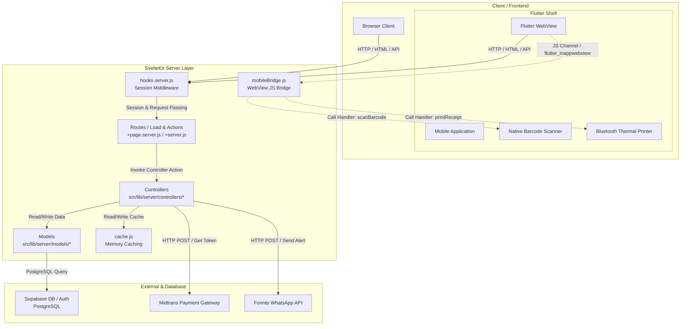

# Analisis Arsitektur Sistem Botanirent

Dokumen ini menjelaskan struktur arsitektur sistem aplikasi **Botanirent** yang digunakan sebagai platform penyewaan alat outdoor.

---

## 1. Ringkasan Teknologi & Ekosistem

Aplikasi Botanirent dirancang dengan arsitektur **Hybrid Web-Mobile** menggunakan kombinasi framework modern dan layanan awan (BaaS):

| Komponen | Teknologi | Deskripsi |
| :--- | :--- | :--- |
| **Framework Utama** | **SvelteKit 2** (Svelte 5 Runes) | Sebagai web framework berbasis SSR (Server-Side Rendering) & CSR (Client-Side Rendering) dengan performa tinggi. |
| **Styling Engine** | **Tailwind CSS v4** | Menyediakan utilitas gaya modern secara efisien dengan performa render optimal. |
| **Backend & Database** | **Supabase (PostgreSQL)** | Layanan database cloud, autentikasi, dan penyimpanan media yang aman menggunakan aturan Row Level Security (RLS). |
| **Mobile Wrapper** | **Flutter WebView** | Mengemas aplikasi web ke dalam aplikasi mobile (Android/iOS) dan menjembatani komunikasi fitur native. |
| **Sistem Pembayaran** | **Midtrans API** | Memfasilitasi pembayaran transaksi menggunakan tokenisasi dan QRIS dinamis. |
| **Sistem Pesan** | **Fonnte WA Gateway** | Mengirimkan notifikasi dan kode OTP langsung ke WhatsApp pelanggan. |

---

## 2. Diagram Arsitektur Sistem

Berikut adalah visualisasi aliran data dan hubungan antar-komponen dalam aplikasi Botanirent:

---

## 3. Pola Desain MVC (Model-View-Controller)

Botanirent menerapkan pola **MVC** yang diadaptasikan dengan paradigma berbasis file-routing milik SvelteKit:

### A. Model (Lapisan Akses Data)
Terletak di direktori `src/lib/server/models/`. Lapisan ini mengisolasi query database Supabase sehingga tidak bercampur dengan logika bisnis.
*   Setiap model adalah objek JavaScript stateless yang menerima instance `supabase` client di setiap fungsinya untuk mematuhi prinsip *isolation*.
*   **Contoh:**
    *   [customerModel.js](file:///c:/Users/rexzy/botani-app/botanirent-web/src/lib/server/models/customerModel.js) – Mengurus CRUD untuk tabel pelanggan.
    *   [categoryModel.js](file:///c:/Users/rexzy/botani-app/botanirent-web/src/lib/server/models/categoryModel.js) – Memproses query data kategori barang.

### B. Controller (Lapisan Logika Bisnis)
Terletak di direktori `src/lib/server/controllers/`. Di sini semua aturan bisnis didefinisikan secara modular.
*   **Contoh:**
    *   [customerController.js](file:///c:/Users/rexzy/botani-app/botanirent-web/src/lib/server/controllers/customerController.js) – Menangani bisnis proses aktivasi, pemblokiran, registrasi, dan validasi data masukan (Zod).
    *   [activityLogController.js](file:///c:/Users/rexzy/botani-app/botanirent-web/src/lib/server/controllers/activityLogController.js) – Menghitung logika pagination, limit baris data log, dan query paralel.

### C. View (Lapisan Presentasi UI)
Terletak di direktori `src/routes/` menggunakan file `+page.svelte` dan dibantu oleh komponen reusable di `src/lib/components/`.
*   Menggunakan Svelte 5 Runes untuk reaktivitas super cepat dan Tailwind CSS v4 untuk responsivitas layout.
*   **Contoh:**
    *   [+page.svelte (POS)](file:///c:/Users/rexzy/botani-app/botanirent-web/src/routes/(app)/pos/+page.svelte) – Halaman kasir / Point of Sale.
    *   [Select.svelte](file:///c:/Users/rexzy/botani-app/botanirent-web/src/lib/components/ui/Select.svelte) – Komponen pilihan dropdown bergaya premium.

### D. Glue Layer (Server Routes / Router SvelteKit)
Terletak pada file `+page.server.js` atau `+server.js` di dalam folder `src/routes/`.
*   Bertindak sebagai penghubung antara request pengguna dari View menuju Controller.
*   Mengecek otorisasi pengguna (RBAC), memvalidasi kecocokan hak akses (Owner vs Staff), mengekstrak data request, lalu menyalurkannya ke Controller.
*   **Contoh:**
    *   [+page.server.js (Activity Log)](file:///c:/Users/rexzy/botani-app/botanirent-web/src/routes/(app)/activity-log/+page.server.js) – Melindungi rute aktivitas agar hanya dapat diakses oleh `owner`, lalu memuat data dari controller.

---

## 4. Mekanisme Kunci & Infrastruktur Pendukung

### A. Middleware Sesi Aman (Session Caching & Hooks)
Melalui [hooks.server.js](file:///c:/Users/rexzy/botani-app/botanirent-web/src/hooks.server.js), sistem memotong semua request masuk untuk menyuntikkan Supabase client ke `event.locals`. 
> [!TIP]
> Guna mengoptimalkan waktu respon server, terdapat *Session Cache* di memori server dengan TTL (Time-To-Live) selama 15 detik. Navigasi berulang dalam waktu singkat tidak akan memaksa server memverifikasi sesi ke server Supabase secara berulang, melainkan memanfaatkan data cache lokal.

### B. Caching Memori Tingkat Aplikasi
Menggunakan modul [cache.js](file:///c:/Users/rexzy/botani-app/botanirent-web/src/lib/server/cache.js) yang menerapkan pola *Cache-Aside* (Lazy Loading).
*   Data yang jarang berubah seperti daftar cabang (`branches`) atau pengaturan aplikasi di-cache untuk durasi tertentu.
*   Mengurangi latensi akses data secara signifikan dan menekan tagihan penggunaan Supabase API.

### C. Jembatan Mobile Wrapper (Hybrid JS Bridge)
Untuk menjembatani fungsionalitas native perangkat keras mobile dengan aplikasi web, proyek menggunakan modul [mobileBridge.js](file:///c:/Users/rexzy/botani-app/botanirent-web/src/lib/utils/mobileBridge.js).
*   Fungsi `isMobileApp()` mendeteksi keberadaan objek `flutter_inappwebview` yang disuntikkan oleh Webview Flutter di perangkat Android/iOS.
*   Membuka akses ke fungsi hardware native melalui *message handlers*:
    *   `scanBarcodeFromMobile()`: Membuka kamera HP untuk memindai barcode fisik barang sewaan.
    *   `printReceiptFromMobile(receiptData)`: Mengirimkan struk transaksi belanja ke printer Bluetooth termal langsung dari kasir.

### D. Integrasi Layanan Pihak Ketiga (Integrations)
*   **Pembayaran Otomatis**: Endpoint [+server.js (Midtrans Token)](file:///c:/Users/rexzy/botani-app/botanirent-web/src/routes/api/midtrans/token/+server.js) melayani request pembuatan *token pembayaran* dan URL redirect pembayaran Midtrans.
*   **Notifikasi WhatsApp**: Modul [fontee.js](file:///c:/Users/rexzy/botani-app/botanirent-web/src/lib/server/fontee.js) menstandarisasi pengiriman pesan teks WhatsApp (OTP / Struk digital) melalui gateway Fonnte dengan pembersihan nomor telepon internasional (ke format `628xxx`).

---

## 5. Kesimpulan Arsitektur

Secara keseluruhan, Botanirent menggunakan arsitektur **Clean MVC Hybrid Web-Mobile**. Struktur ini sangat kuat karena memisahkan tanggung jawab visual (View), logika sistem (Controller), dan representasi data (Model). Dengan integrasi mobile bridge dan server-side caching, aplikasi ini siap menyajikan performa instan di peramban web maupun aplikasi mobile native.
