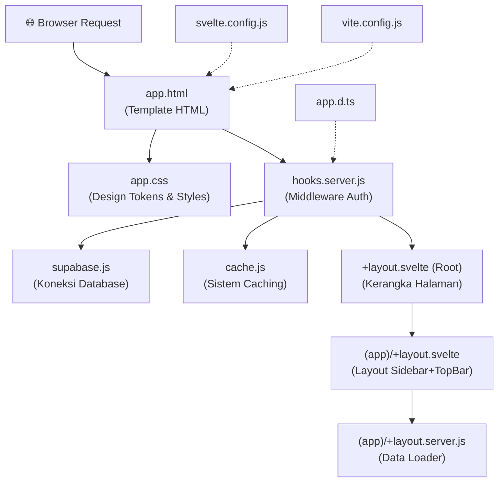
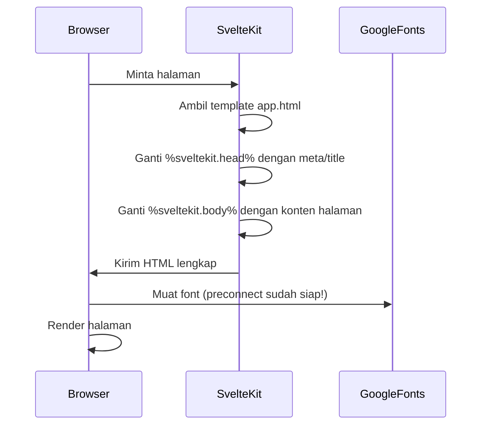
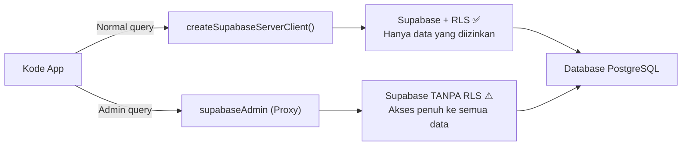
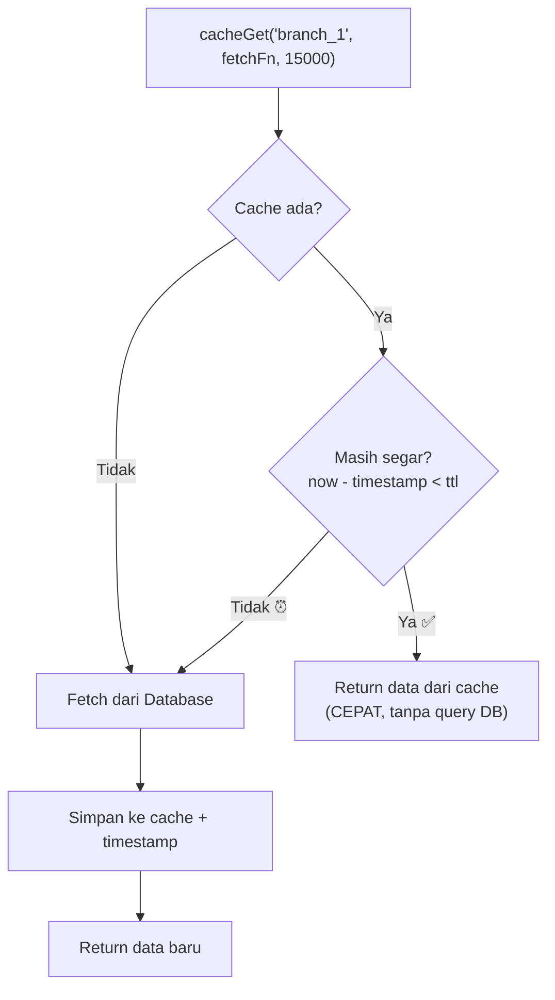
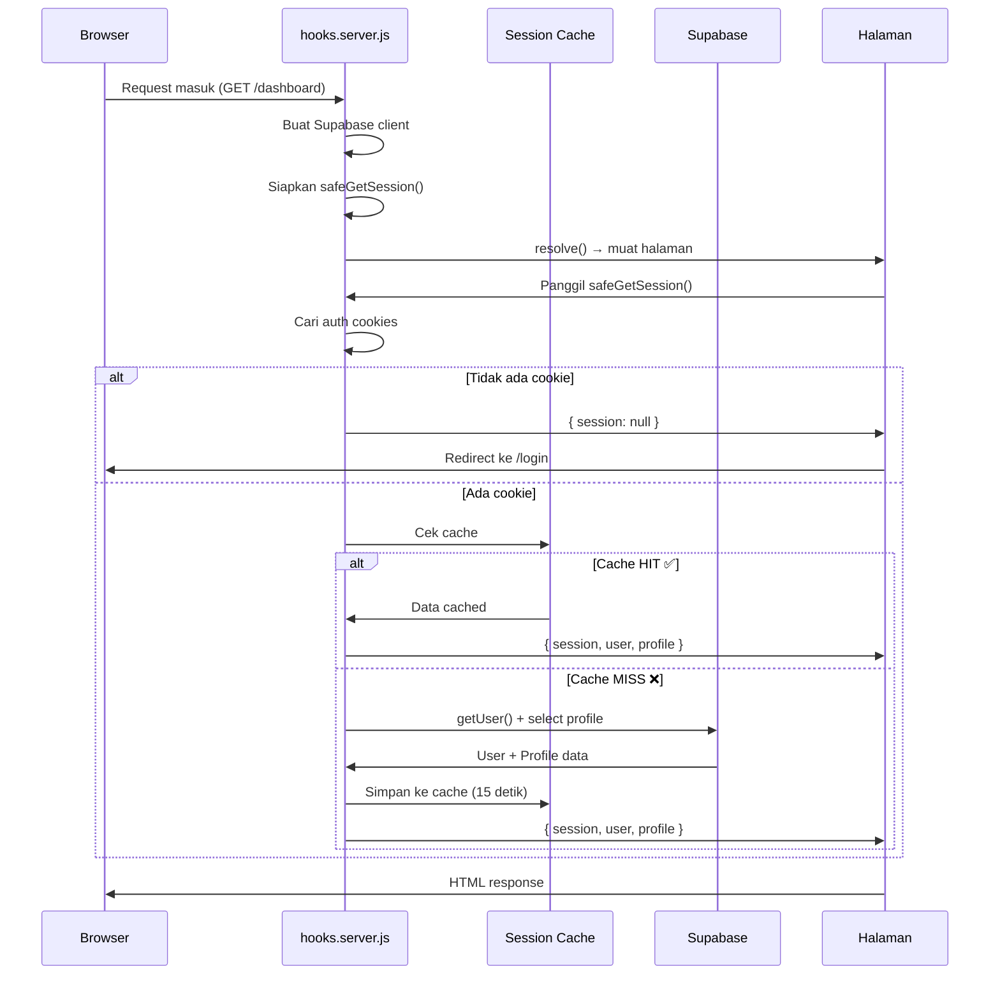
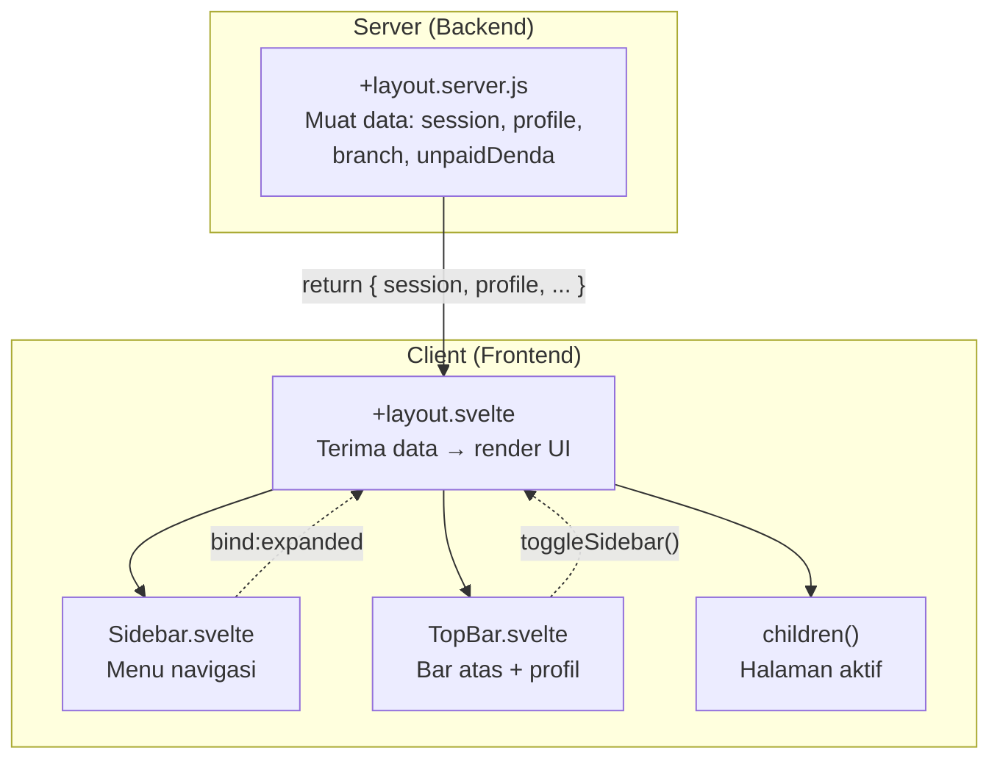
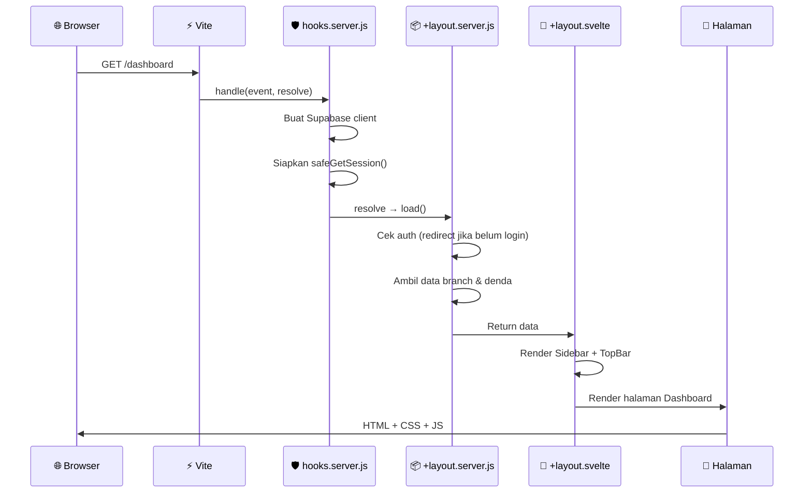

# 📘 Modul 1: Fondasi BotaniRent Web

> **Tujuan Modul**: Memahami file-file fondasi yang menjadi "tulang punggung" seluruh aplikasi BotaniRent. Tanpa file-file ini, aplikasi tidak akan bisa berjalan.

---

## 🗺️ Peta File Modul Ini



**Urutan baca yang direkomendasikan:**
1. `vite.config.js` & `svelte.config.js` → Konfigurasi build
2. `app.html` → Template HTML utama
3. `app.css` → Sistem desain
4. `app.d.ts` → Type definitions
5. `supabase.js` → Koneksi database
6. `cache.js` → Sistem caching
7. `hooks.server.js` → Middleware autentikasi
8. `+layout.svelte` (Root) & `(app)/+layout.svelte` → Kerangka halaman

---

## 📄 File 1: `vite.config.js` — Konfigurasi Build Tool

> **Lokasi**: [vite.config.js](file:///c:/Users/rexzy/botani-app/botanirent-web/vite.config.js)

### Ringkasan
File ini mengonfigurasi **Vite**, yaitu build tool yang bertugas mengubah kode SvelteKit menjadi aplikasi web yang bisa dijalankan browser. Bayangkan Vite seperti **"penerjemah"** — dia menerjemahkan kode `.svelte` menjadi HTML/CSS/JS yang browser pahami.

### Kode + Penjelasan

```js
// =====================================================
// IMPORT: Mengambil plugin yang dibutuhkan
// =====================================================

import tailwindcss from '@tailwindcss/vite';
// 📌 Plugin Tailwind CSS untuk Vite
// Tailwind CSS = utility CSS framework (contoh: "bg-red-500" = background merah)
// Plugin ini memproses class Tailwind menjadi CSS yang siap pakai

import { sveltekit } from '@sveltejs/kit/vite';
// 📌 Plugin SvelteKit untuk Vite
// Tanpa ini, Vite tidak tahu cara memproses file .svelte

import { defineConfig } from 'vite';
// 📌 Helper function dari Vite untuk mendefinisikan konfigurasi
// Memberikan autocomplete & validasi di editor

// =====================================================
// KONFIGURASI UTAMA
// =====================================================

export default defineConfig({
    plugins: [tailwindcss(), sveltekit()],
    // 📌 Daftar plugin yang aktif:
    //    1. tailwindcss() → proses Tailwind CSS
    //    2. sveltekit()   → proses file .svelte dan routing
    // 
    // ⚠️ URUTAN PENTING! Tailwind harus sebelum SvelteKit
    //    karena CSS perlu diproses dulu sebelum komponen Svelte

    ssr: {
        noExternal: ['svelte-sonner']
        // 📌 SSR = Server-Side Rendering
        // Artinya: halaman dirender di server dulu, baru dikirim ke browser
        //
        // noExternal: artinya library 'svelte-sonner' (library toast/notifikasi)
        // harus di-bundle bersama kode server, bukan dibiarkan sebagai external
        //
        // 🤔 MENGAPA? Karena svelte-sonner menggunakan syntax yang hanya bisa
        //    diproses oleh Vite. Kalau dibiarkan external, Node.js akan error
        //    karena tidak mengerti syntax tersebut.
    }
});
```

### Konsep yang Dipelajari
| Konsep | Penjelasan Sederhana |
|--------|---------------------|
| **Build Tool** | Alat yang mengubah kode developer menjadi kode yang browser pahami |
| **Plugin** | Tambahan kemampuan untuk build tool, seperti "mod" di game |
| **SSR** | Server merender halaman HTML terlebih dahulu sebelum dikirim ke browser |
| **Bundle** | Proses menggabungkan banyak file JS menjadi sedikit file untuk performa |

---

## 📄 File 2: `svelte.config.js` — Konfigurasi SvelteKit

> **Lokasi**: [svelte.config.js](file:///c:/Users/rexzy/botani-app/botanirent-web/svelte.config.js)

### Ringkasan
File ini mengonfigurasi **SvelteKit** sebagai framework aplikasi. Ibaratnya, kalau Vite adalah "mesin mobil", maka `svelte.config.js` adalah "dashboard kontrol" yang mengatur bagaimana mesin tersebut beroperasi.

### Kode + Penjelasan

```js
import adapter from '@sveltejs/adapter-vercel';
// 📌 ADAPTER = "penerjemah deployment"
// 
// SvelteKit bisa di-deploy ke berbagai platform (Vercel, Netlify, Node.js, dll)
// Adapter ini mengubah output SvelteKit menjadi format yang Vercel pahami
//
// 🏠 Analogi: Seperti memilih tipe colokan listrik yang sesuai dengan negara tujuan
// adapter-vercel = colokan untuk Vercel
// adapter-node   = colokan untuk server Node.js biasa
// adapter-static = colokan untuk hosting statis (GitHub Pages)

/** @type {import('@sveltejs/kit').Config} */
// 📌 JSDoc type annotation
// Ini memberi tahu editor bahwa variabel 'config' bertipe Config dari SvelteKit
// Efeknya: kamu dapat autocomplete saat mengetik property config

const config = {
    compilerOptions: {
        // 📌 Opsi untuk COMPILER Svelte (yang mengubah .svelte → .js)
        
        runes: ({ filename }) => 
            (filename.split(/[/\\]/).includes('node_modules') ? undefined : true)
        // 📌 RUNES MODE = fitur baru Svelte 5
        //
        // Svelte 5 punya 2 cara menulis kode:
        //   - Runes mode (baru): $state(), $derived(), $effect()
        //   - Legacy mode (lama): let count = 0; (reactivity otomatis)
        //
        // Kode di atas artinya:
        //   - Jika file ada di node_modules → biarkan (undefined = ikuti default library)
        //   - Jika file BUKAN di node_modules → paksa pakai runes mode (true)
        //
        // 🤔 MENGAPA? Karena kode kita sendiri mau pakai Svelte 5 runes,
        //    tapi library pihak ketiga mungkin masih pakai mode lama.
        //    Kalau dipaksa runes semua, library bisa error.
        //
        // 🔍 Cara kerja: filename.split(/[/\\]/) memecah path file jadi array
        //    Contoh: "src/routes/+page.svelte" → ["src","routes","+page.svelte"]
        //    Lalu .includes('node_modules') → cek apakah ada folder node_modules
    },
    kit: {
        adapter: adapter()
        // 📌 Pakai adapter Vercel yang sudah di-import di atas
        // adapter() dipanggil sebagai function karena bisa menerima opsi tambahan
    }
};

export default config;
// 📌 Mengekspor konfigurasi agar SvelteKit bisa membacanya
```

### Konsep yang Dipelajari
| Konsep | Penjelasan Sederhana |
|--------|---------------------|
| **Adapter** | Plugin yang mengubah output SvelteKit sesuai platform deployment |
| **Compiler** | Program yang menerjemahkan kode sumber menjadi kode yang bisa dieksekusi |
| **Runes** | Fitur reactivity baru di Svelte 5 (`$state`, `$derived`, `$effect`) |
| **JSDoc** | Sistem komentar khusus untuk menambahkan type info di JavaScript |

---

## 📄 File 3: `app.html` — Template HTML Utama

> **Lokasi**: [app.html](file:///c:/Users/rexzy/botani-app/botanirent-web/src/app.html)

### Ringkasan
File ini adalah **"cangkang"** HTML yang membungkus seluruh aplikasi. Semua halaman SvelteKit akan dimasukkan ke dalam template ini. Bayangkan ini seperti **bingkai foto** — foto (konten) berubah-ubah, tapi bingkainya tetap sama.

### Kode + Penjelasan

```html
<!doctype html>
<!-- 📌 Memberitahu browser bahwa ini dokumen HTML5 -->

<html lang="en">
<!-- 📌 lang="en" memberi tahu browser & screen reader bahwa bahasa utama = English
     Ini penting untuk:
     - Aksesibilitas (pembaca layar tahu harus pakai suara bahasa apa)
     - SEO (mesin pencari tahu bahasa halaman) -->

    <head>
        <meta charset="utf-8" />
        <!-- 📌 Encoding karakter UTF-8 = mendukung semua huruf di dunia
             Tanpa ini: karakter Indonesia seperti "ñ" atau emoji bisa tampil rusak -->

        <meta name="viewport" content="width=device-width, initial-scale=1" />
        <!-- 📌 RESPONSIF! Ini yang membuat halaman menyesuaikan ukuran layar
             - width=device-width: lebar halaman = lebar perangkat
             - initial-scale=1: zoom awal = 100%
             Tanpa ini: halaman akan tampil kecil di HP karena browser
             menganggap halaman dibuat untuk desktop -->

        <meta name="text-scale" content="scale" />
        <!-- 📌 Meta tag khusus untuk mengontrol scaling teks 
             Membantu teks menyesuaikan diri di berbagai ukuran layar -->

        <link rel="preconnect" href="https://fonts.googleapis.com" />
        <link rel="preconnect" href="https://fonts.gstatic.com" crossorigin />
        <!-- 📌 PRECONNECT = "siapkan koneksi duluan"
             Browser memulai koneksi ke Google Fonts SEBELUM benar-benar membutuhkan font
             
             🏠 Analogi: Seperti memanaskan mesin mobil sebelum berangkat
             Sehingga saat font dibutuhkan, koneksi sudah siap → halaman lebih cepat
             
             crossorigin: diperlukan karena font berasal dari domain berbeda -->

        <link href="https://fonts.googleapis.com/css2?family=Inter:wght@400;500;600;700&family=Outfit:wght@400;500;600;700&family=JetBrains+Mono:wght@400;500;600;700&display=swap" rel="stylesheet" />
        <!-- 📌 Memuat 3 FONT dari Google Fonts:
             1. Inter          → Font untuk body text (paragraf, label)
             2. Outfit         → Font untuk heading (judul)
             3. JetBrains Mono → Font monospace (angka, harga, kode)
             
             wght@400;500;600;700 = berat font yang dimuat:
               400 = Regular, 500 = Medium, 600 = SemiBold, 700 = Bold
             
             display=swap: tampilkan teks dengan font default dulu,
               lalu SWAP (ganti) ke Google Font setelah dimuat.
               Ini mencegah teks menghilang saat font belum dimuat (FOIT) -->

        %sveltekit.head%
        <!-- 📌 ⭐ PLACEHOLDER SvelteKit
             SvelteKit akan MENGGANTI teks ini dengan:
             - <title> dari setiap halaman
             - <meta> tags (SEO)
             - <link> dan <script> yang dibutuhkan halaman
             
             Contoh: Halaman dashboard akan mengganti ini dengan:
             <title>Dashboard - BotaniRent</title> -->
    </head>

    <body data-sveltekit-preload-data="hover">
    <!-- 📌 data-sveltekit-preload-data="hover"
         Fitur PERFORMA dari SvelteKit:
         Saat user mengarahkan mouse ke sebuah link (hover),
         SvelteKit otomatis MEMUAT DATA halaman tersebut di background
         
         🏠 Analogi: Seperti pelayan restoran yang sudah menyiapkan makanan
         saat melihat pelanggan membaca menu, sehingga saat dipesan → langsung tersaji
         
         Efek: Navigasi terasa INSTAN karena data sudah di-load sebelum diklik -->

        <div>%sveltekit.body%</div>
        <!-- 📌 ⭐ PLACEHOLDER UTAMA
             SvelteKit akan mengganti %sveltekit.body% dengan
             seluruh konten aplikasi (layout + halaman aktif)
             
             Ini adalah "lubang" di mana seluruh app Svelte ditampilkan -->
    </body>
</html>
```

### Alur Eksekusi


---

## 📄 File 4: `app.css` — Sistem Desain (Design Tokens)

> **Lokasi**: [app.css](file:///c:/Users/rexzy/botani-app/botanirent-web/src/app.css)

### Ringkasan
File ini adalah **"buku panduan desain"** seluruh aplikasi. Di sini didefinisikan semua warna, font, ukuran, bayangan, dan animasi yang dipakai di seluruh app. Dalam dunia desain, ini disebut **Design Tokens** — nilai-nilai desain yang konsisten.

### Kode + Penjelasan

```css
@import 'tailwindcss';
/* 📌 Mengimpor seluruh framework Tailwind CSS
   Ini menambahkan ribuan utility class seperti:
   - bg-red-500 (background merah)
   - p-4 (padding 16px)
   - flex (display: flex)
   Tailwind v4 menggunakan @import alih-alih @tailwind directives */

@plugin '@tailwindcss/typography';
/* 📌 Plugin Typography dari Tailwind
   Menambahkan class 'prose' untuk memformat konten teks panjang
   (seperti artikel, deskripsi produk) agar otomatis rapi dan mudah dibaca */

/* ================================================================
   BotaniRent — Design Tokens "Alpine Earth"
   Earthy, Warm, Natural
   ================================================================ */

/* 📌 TEMA DESAIN: "Alpine Earth"
   Terinspirasi dari alam pegunungan — warna tanah, hijau hutan, hangat
   Cocok untuk brand outdoor/camping seperti BotaniRent */

@theme {
    /* 📌 @theme adalah fitur Tailwind CSS v4
       Semua variabel yang didefinisikan di sini bisa dipakai sebagai:
       - CSS variable: var(--color-forest)
       - Tailwind class: bg-forest, text-sage, dll
       
       🤔 MENGAPA pakai @theme?
       Agar warna bisa dipakai DI DUA TEMPAT:
       1. Di file CSS biasa → var(--color-forest)
       2. Di class Tailwind → class="bg-forest" */

    /* === Warna Utama (Primary) === */
    --color-forest: #2d5016;       /* Hijau hutan tua — warna brand utama */
    --color-forest-dark: #244012;  /* Versi lebih gelap — untuk hover state */
    --color-forest-light: #3a6a1e; /* Versi lebih terang — variasi */
    --color-sage: #6b8f4e;         /* Hijau sage — untuk aksen & border fokus */
    --color-sage-10: rgba(107, 143, 78, 0.1);  /* Sage dengan 10% opacity — background ringan */
    --color-sage-20: rgba(107, 143, 78, 0.2);  /* Sage dengan 20% opacity — selection highlight */

    /* 🤔 MENGAPA ada 3 varian hijau?
       Untuk VISUAL HIERARCHY & INTERACTION STATES:
       - forest      = warna tombol normal
       - forest-dark = warna tombol saat ditekan (active)  → memberi feedback visual
       - forest-light= warna tombol saat di-hover          → memberi feedback visual
       Ini membuat UI terasa "hidup" dan responsif terhadap interaksi user */

    /* === Warna Sekunder === */
    --color-amber: #d4a843;       /* Kuning amber — untuk highlight, badge promo */
    --color-terracotta: #c85a3a;  /* Merah bata — untuk aksen kontras */

    /* === Background === */
    --color-cream: #faf6f0;         /* Krem — background utama seluruh app */
    --color-charcoal: #1a1a1a;      /* Hitam arang — untuk dark elements */
    --color-sand: #f0e8d8;          /* Pasir — background card/section */
    --color-sand-light: #e8dfc8;    /* Pasir terang — border, separator */
    --color-sand-lightest: #fdfbf7; /* Pasir paling terang — subtle backgrounds */

    /* 🤔 MENGAPA ada 3 varian sand?
       Untuk membuat DEPTH (kedalaman) visual tanpa pakai warna terang yang mencolok
       Semakin gelap = semakin "dalam" atau penting secara visual */

    /* === Teks === */
    --color-earth: #2c2418;  /* Cokelat tanah — teks utama (body text) */
    --color-stone: #7a7062;  /* Abu batu — teks sekunder (keterangan) */
    --color-muted: #b0a696;  /* Abu pudar — teks disabled/placeholder */

    /* 🤔 MENGAPA 3 warna teks?
       Untuk TEXT HIERARCHY (hierarki teks):
       - earth = paling penting (judul, konten utama) → paling gelap
       - stone = penjelasan tambahan → medium
       - muted = tidak penting (placeholder) → paling terang
       Mata user otomatis tertarik ke teks yang paling gelap dulu */

    /* === Status (Semantic) === */
    --color-success: #4a7c3f;                     /* Hijau — sukses, tersedia */
    --color-success-bg: rgba(74, 124, 63, 0.1);   /* Background hijau transparan */
    --color-warning: #e8a820;                      /* Kuning — peringatan */
    --color-warning-bg: rgba(232, 168, 32, 0.1);  /* Background kuning transparan */
    --color-error: #c44032;                        /* Merah — error, bahaya */
    --color-error-bg: rgba(196, 64, 50, 0.1);     /* Background merah transparan */
    --color-info: #3b82b0;                         /* Biru — informasi */
    --color-info-bg: rgba(59, 130, 176, 0.1);     /* Background biru transparan */

    /* 📌 SEMANTIC COLORS = warna yang punya "makna"
       User di seluruh dunia memahami:
       - Hijau = baik/sukses     - Kuning = hati-hati
       - Merah = error/bahaya    - Biru = informasi
       
       Versi _bg (background) = warna sama tapi sangat transparan (10%)
       Dipakai sebagai latar badge/alert agar tidak terlalu mencolok */

    /* === Border === */
    --color-border: #d6cbbb;        /* Border default */
    --color-border-light: #e8dfc8;  /* Border lebih ringan */
    --color-border-focus: #6b8f4e;  /* Border saat elemen fokus (keyboard nav) */

    /* === Font Family === */
    --font-heading: 'Outfit', sans-serif;          /* Font untuk judul */
    --font-body: 'Inter', sans-serif;              /* Font untuk body text */
    --font-mono: 'JetBrains Mono', monospace;      /* Font untuk angka/harga */

    /* 📌 MENGAPA 3 font berbeda?
       - Heading font (Outfit) = lebih tebal & elegan → menarik perhatian untuk judul
       - Body font (Inter) = sangat mudah dibaca → nyaman untuk paragraf panjang
       - Mono font (JetBrains Mono) = lebar huruf sama → angka/harga rata & rapi
         Contoh: Rp 1.000.000 vs Rp 100.000 → angka-angkanya sejajar */

    /* === Border Radius === */
    --radius-sm: 6px;      /* Sedikit bulat — input, badge kecil */
    --radius-md: 8px;      /* Sedang — card, tombol */
    --radius-lg: 12px;     /* Bulat — card besar */
    --radius-xl: 16px;     /* Sangat bulat — modal, panel */
    --radius-full: 9999px; /* Lingkaran penuh — avatar, pill badge */

    /* === Shadow (warm-toned) === */
    --shadow-sm: 0 1px 3px rgba(44, 36, 24, 0.06), 0 1px 2px rgba(44, 36, 24, 0.04);
    --shadow-md: 0 4px 6px rgba(44, 36, 24, 0.07), 0 2px 4px rgba(44, 36, 24, 0.04);
    --shadow-lg: 0 10px 15px rgba(44, 36, 24, 0.08), 0 4px 6px rgba(44, 36, 24, 0.04);
    --shadow-xl: 0 20px 25px rgba(44, 36, 24, 0.1), 0 8px 10px rgba(44, 36, 24, 0.04);
    --shadow-inner: inset 0 2px 4px rgba(44, 36, 24, 0.05);

    /* 📌 SHADOW menggunakan warna COKELAT (rgba(44,36,24,...))
       bukan hitam (rgba(0,0,0,...)) yang biasa
       
       🤔 MENGAPA? Karena shadow cokelat terasa lebih HANGAT dan NATURAL
       sesuai tema "Alpine Earth". Shadow hitam akan terasa dingin dan digital.
       
       Setiap shadow punya 2 lapisan:
       - Lapisan 1: bayangan utama (lebih besar, lebih transparan)
       - Lapisan 2: bayangan halus dekat elemen (lebih kecil, lebih padat)
       Kombinasi ini membuat shadow terlihat lebih realistis */

    /* === Transition === */
    --transition-fast: 150ms cubic-bezier(0.4, 0, 0.2, 1);   /* Cepat — hover, toggle */
    --transition-normal: 250ms cubic-bezier(0.4, 0, 0.2, 1); /* Normal — animasi UI */
    --transition-slow: 350ms cubic-bezier(0.4, 0, 0.2, 1);   /* Lambat — modal, panel */

    /* 📌 cubic-bezier(0.4, 0, 0.2, 1) = "ease curve" untuk animasi
       Artinya: animasi mulai pelan, mempercepat, lalu melambat di akhir
       Ini terasa lebih NATURAL dibanding linear (kecepatan konstan)
       
       🏠 Analogi: Seperti mobil yang mengakselerasi lalu mengerem pelan
       bukan seperti kereta yang bergerak konstan */
}

/* ================================================================
   Base Styles — Gaya dasar untuk seluruh elemen
   ================================================================ */

*, *::before, *::after {
    box-sizing: border-box;
    /* 📌 BOX-SIZING: BORDER-BOX
       Salah satu CSS rule TERPENTING!
       
       Default CSS: width 100px + padding 20px = total 140px (menyebalkan!)
       border-box:  width 100px + padding 20px = total tetap 100px ✅
       
       Artinya: padding & border dihitung DALAM width, bukan ditambahkan
       Ini membuat layout JAUH lebih mudah diprediksi */
}

html {
    font-family: var(--font-body);
    /* 📌 Font default = Inter (body font)
       Semua teks akan pakai Inter kecuali di-override */

    color: var(--color-earth);
    /* 📌 Warna teks default = cokelat tanah
       Bukan hitam murni (#000) karena terlalu kontras & melelahkan mata */

    background-color: var(--color-cream);
    /* 📌 Background default = krem hangat */

    -webkit-font-smoothing: antialiased;
    -moz-osx-font-smoothing: grayscale;
    /* 📌 Membuat teks terlihat LEBIH HALUS di Mac/Chrome
       Tanpa ini: teks bisa terlihat "tebal" dan kasar di beberapa browser */
}

body {
    margin: 0;           /* Hapus margin default browser (biasanya 8px) */
    min-height: 100vh;   /* Minimal setinggi viewport (layar) */
}

h1, h2, h3, h4, h5, h6 {
    font-family: var(--font-heading);  /* Heading pakai font Outfit */
    font-weight: 700;                  /* Tebal (bold) */
    line-height: 1.3;                  /* Jarak antar baris = 130% ukuran font */
}

/* === Animasi === */

/* 📌 KEYFRAMES = definisi animasi frame-by-frame
   Seperti membuat "storyboard" animasi:
   - from/0% = keadaan awal
   - to/100% = keadaan akhir
   Browser otomatis mengisi transisi di antaranya */

@keyframes skeleton-pulse {
    /* 📌 Animasi "berkedip" untuk loading skeleton
       0%   → opacity 0.4 (redup)
       50%  → opacity 1 (terang)
       100% → opacity 0.4 (redup lagi) → ulangi
       Efek: elemen "bernapas" → user tahu sedang loading */
    0%, 100% { opacity: 0.4; }
    50% { opacity: 1; }
}

.skeleton {
    animation: skeleton-pulse 1.5s ease-in-out infinite;
    /* 📌 Durasi 1.5 detik, ease-in-out, loop infinite
       class ini ditambahkan ke elemen placeholder saat data belum dimuat */
    background-color: var(--color-sand);
    border-radius: var(--radius-sm);
}

@keyframes fade-in {
    /* 📌 Animasi muncul dari bawah dengan efek fade
       from: transparan + sedikit di bawah (4px)
       to:   terlihat penuh + posisi normal
       Efek: konten "muncul naik" dengan lembut */
    from { opacity: 0; transform: translateY(4px); }
    to   { opacity: 1; transform: translateY(0); }
}

@keyframes slide-in-right {
    /* 📌 Animasi masuk dari kanan (untuk toast/notifikasi)
       Toast muncul dari sisi kanan layar */
    from { transform: translateX(100%); opacity: 0; }
    to   { transform: translateX(0); opacity: 1; }
}

@keyframes modal-in {
    /* 📌 Animasi modal muncul dengan efek zoom-in
       from: sedikit mengecil (95%) + transparan
       to:   ukuran normal (100%) + terlihat
       Efek: modal "muncul membesar" dengan halus */
    from { opacity: 0; transform: scale(0.95); }
    to   { opacity: 1; transform: scale(1); }
}
```

### Konsep yang Dipelajari
| Konsep | Penjelasan Sederhana |
|--------|---------------------|
| **Design Tokens** | Nilai-nilai desain (warna, ukuran, font) yang disimpan sebagai variabel agar konsisten di seluruh app |
| **CSS Variables** | Variabel di CSS yang bisa dipakai ulang: `var(--nama-variabel)` |
| **Semantic Colors** | Warna yang punya makna universal (hijau=sukses, merah=error) |
| **CSS Animations** | Animasi yang didefinisikan dengan `@keyframes` dan dipakai dengan property `animation` |
| **Box Model** | Cara CSS menghitung ukuran elemen (content + padding + border + margin) |

---

## 📄 File 5: `app.d.ts` — Type Definitions

> **Lokasi**: [app.d.ts](file:///c:/Users/rexzy/botani-app/botanirent-web/src/app.d.ts)

### Ringkasan
File ini mendefinisikan **tipe data** (types) yang tersedia secara global di seluruh aplikasi. File ini **tidak dijalankan** — ia hanya memberitahu editor (VS Code) apa saja yang tersedia, sehingga editor bisa memberikan autocomplete dan mendeteksi error.

### Kode + Penjelasan

```ts
// 📌 File .d.ts = "Declaration file" (file deklarasi)
// Seperti "katalog" yang menjelaskan bentuk data tanpa mengeksekusi kode

declare global {
    // 📌 declare global = "umumkan ke seluruh aplikasi"
    // Apapun yang didefinisikan di sini bisa diakses dari mana saja

    namespace App {
        // 📌 namespace App = namespace khusus SvelteKit
        // SvelteKit akan membaca definisi di sini untuk mengetahui
        // bentuk data yang tersedia di hooks, load functions, dll

        // interface Error {}
        // 📌 (Dikomentari) Bisa digunakan untuk menambah field custom ke error

        interface Locals {
            // 📌 Locals = data yang tersedia DI SETIAP REQUEST server
            // Setiap kali ada request masuk, SvelteKit menyediakan objek 'locals'
            // yang bisa diisi data apapun oleh hooks.server.js

            supabase: import('@supabase/supabase-js').SupabaseClient;
            // 📌 Property 'supabase' bertipe SupabaseClient
            // Ini adalah koneksi ke database yang disiapkan oleh hooks.server.js
            // Setiap halaman bisa mengakses database lewat locals.supabase

            safeGetSession: () => Promise<{
                session: import('@supabase/supabase-js').Session | null;
                user: import('@supabase/supabase-js').User | null;
                profile: any | null;
            }>;
            // 📌 Function untuk mendapatkan data sesi user yang sedang login
            // Mengembalikan:
            //   - session: informasi sesi (token, expiry)
            //   - user: data user Supabase (id, email)
            //   - profile: data profil dari tabel 'profiles' (nama, role, branch)
            //
            // Promise<...> artinya function ini ASYNCHRONOUS
            // (perlu di-await karena mengambil data dari database)
            //
            // | null artinya BISA KOSONG (jika user belum login)
        }

        // interface PageData {}    ← Bisa untuk tipe data halaman
        // interface PageState {}   ← Bisa untuk tipe state halaman
        // interface Platform {}    ← Bisa untuk tipe platform deployment
    }
}

export {};
// 📌 Baris ini WAJIB ada!
// Tanpa export {}, TypeScript menganggap file ini sebagai "script" biasa
// bukan "module". Dengan export {}, file ini dianggap module
// dan declare global baru bisa bekerja dengan benar
```

### Konsep yang Dipelajari
| Konsep | Penjelasan Sederhana |
|--------|---------------------|
| **TypeScript Declaration** | File `.d.ts` yang mendeskripsikan bentuk data tanpa kode eksekusi |
| **Interface** | "Kontrak" yang menjelaskan properti dan tipe yang harus dimiliki sebuah objek |
| **Namespace** | Pengelompokan nama agar tidak bentrok (seperti folder untuk tipe) |
| **Promise** | Objek yang merepresentasikan operasi async yang belum selesai |
| **Union Type** (`\|`) | Tipe yang bisa salah satu dari beberapa kemungkinan (`Session \| null`) |

---

## 📄 File 6: `supabase.js` — Koneksi ke Database

> **Lokasi**: [supabase.js](file:///c:/Users/rexzy/botani-app/botanirent-web/src/lib/server/supabase.js)

### Ringkasan
File ini membuat **koneksi ke Supabase** (layanan database cloud). Ada 2 jenis koneksi:
1. **Client biasa** → menghormati aturan keamanan (RLS), dipakai untuk operasi normal
2. **Admin client** → melewati semua aturan keamanan, dipakai hanya untuk operasi khusus

### Kode + Penjelasan

```js
import { createServerClient } from '@supabase/ssr';
// 📌 createServerClient = function dari Supabase untuk membuat client di SERVER
// Versi SSR (Server-Side Rendering) yang bisa mengelola cookies

import { PUBLIC_SUPABASE_URL, PUBLIC_SUPABASE_PUBLISHABLE_KEY } from '$env/static/public';
// 📌 Mengambil variabel environment yang BOLEH diketahui publik:
//    - PUBLIC_SUPABASE_URL = alamat database Supabase (contoh: https://xxx.supabase.co)
//    - PUBLIC_SUPABASE_PUBLISHABLE_KEY = API key publik (aman di-expose)
//
// $env/static/public = cara SvelteKit membaca file .env
// Prefix PUBLIC_ artinya variabel ini boleh dikirim ke browser

import { PRIVATE_SUPABASE_SERVICE_ROLE_KEY } from '$env/static/private';
// 📌 Variabel environment yang RAHASIA (hanya server yang boleh tahu)
// Service Role Key = "kunci admin" yang bisa melewati semua aturan keamanan
// ⚠️ JANGAN PERNAH mengirim key ini ke browser!

import { createClient } from '@supabase/supabase-js';
// 📌 createClient = function untuk membuat client Supabase biasa (non-SSR)
// Dipakai untuk admin client yang tidak perlu mengelola cookies

// =====================================================
// CLIENT BIASA (menghormati RLS / Row Level Security)
// =====================================================

export const createSupabaseServerClient = (event) => {
    // 📌 Function ini MEMBUAT client Supabase baru untuk setiap request
    // Parameter 'event' = objek request dari SvelteKit yang berisi cookies, URL, dll
    
    return createServerClient(PUBLIC_SUPABASE_URL, PUBLIC_SUPABASE_PUBLISHABLE_KEY, {
        cookies: {
            getAll: () => event.cookies.getAll(),
            // 📌 Memberitahu Supabase cara MEMBACA semua cookies
            // Supabase menyimpan auth token di cookies browser
            
            setAll: (cookiesToSet) => {
                // 📌 Memberitahu Supabase cara MENULIS cookies
                // Dipanggil saat session di-refresh (token baru)
                try {
                    cookiesToSet.forEach(({ name, value, options }) => {
                        event.cookies.set(name, value, { ...options, path: '/' });
                        // 📌 Set cookie dengan path: '/' artinya cookie berlaku
                        // untuk SEMUA halaman di website
                    });
                } catch {
                    // 📌 Try-catch karena ada konteks di mana cookies TIDAK BISA di-set
                    // Contoh: di dalam Server Component atau +page.js (bukan +page.server.js)
                    // Error ini aman diabaikan
                }
            }
        }
    });
};

// =====================================================
// ADMIN CLIENT (melewati SEMUA aturan keamanan)
// =====================================================

// 📌 🔴 HANYA GUNAKAN UNTUK OPERASI YANG MEMBUTUHKAN AKSES PENUH
// Contoh: auto-create profile, menghapus user, bypass RLS

let adminClient = null;  // Variable untuk menyimpan instance client admin

export const supabaseAdmin = new Proxy(
    {},  // 📌 Target: objek kosong
    {
        get(target, prop) {
            // 📌 PROXY PATTERN (Pola Desain)
            // 
            // Proxy = "perantara" yang mencegat akses ke objek
            // Setiap kali kode mengakses supabaseAdmin.apapun,
            // function get() ini akan dipanggil dulu
            //
            // 🤔 MENGAPA pakai Proxy?
            // Untuk LAZY INITIALIZATION (inisialisasi malas)
            // Client admin TIDAK dibuat saat file di-import,
            // tapi HANYA saat pertama kali digunakan
            //
            // Ini mencegah error saat development reload,
            // karena environment variables mungkin belum tersedia
            // saat file pertama kali di-load

            if (!adminClient) {
                // 📌 Jika admin client belum dibuat, buat sekarang
                
                if (!PUBLIC_SUPABASE_URL || !PRIVATE_SUPABASE_SERVICE_ROLE_KEY) {
                    throw new Error(
                        'PUBLIC_SUPABASE_URL or PRIVATE_SUPABASE_SERVICE_ROLE_KEY is missing...'
                    );
                    // 📌 Jika env variables belum ada, lempar error yang jelas
                    // Ini membantu debugging: kamu tahu pasti masalahnya di mana
                }
                
                adminClient = createClient(PUBLIC_SUPABASE_URL, PRIVATE_SUPABASE_SERVICE_ROLE_KEY, {
                    auth: {
                        autoRefreshToken: false,
                        // 📌 JANGAN refresh token otomatis
                        // Admin client tidak punya "sesi" yang perlu di-refresh
                        
                        persistSession: false
                        // 📌 JANGAN simpan sesi
                        // Admin client berjalan di server, tidak perlu persist
                    }
                });
            }
            
            const val = adminClient[prop];
            if (typeof val === 'function') {
                return val.bind(adminClient);
                // 📌 .bind() = pastikan function tetap "terikat" ke adminClient
                // Tanpa bind, 'this' di dalam function bisa salah
                //
                // Contoh: supabaseAdmin.from('profiles') 
                // → from() harus tahu bahwa 'this' = adminClient
            }
            return val;
        }
    }
);
```

### Alur Eksekusi: Dua Jenis Client



### Konsep yang Dipelajari
| Konsep | Penjelasan Sederhana |
|--------|---------------------|
| **Environment Variables** | Nilai rahasia yang disimpan di file `.env`, bukan di kode |
| **Proxy Pattern** | Pola desain: objek perantara yang mencegat akses ke objek asli |
| **Lazy Initialization** | Membuat objek HANYA saat pertama kali dibutuhkan, bukan saat awal |
| **RLS (Row Level Security)** | Aturan di database: user hanya bisa akses data yang diizinkan |
| **Cookies** | Data kecil yang disimpan browser, digunakan untuk menyimpan auth token |
| **bind()** | Method JS untuk "mengunci" konteks `this` pada sebuah function |

---

## 📄 File 7: `cache.js` — Sistem Caching

> **Lokasi**: [cache.js](file:///c:/Users/rexzy/botani-app/botanirent-web/src/lib/server/cache.js)

### Ringkasan
File ini menyediakan **sistem caching** sederhana untuk menghindari query database yang berulang. Bayangkan seperti **"catatan tempel"** — daripada selalu bertanya ke database, kita simpan jawaban terakhir dan pakai selama masih relevan.

### Kode + Penjelasan

```js
const cache = new Map();
// 📌 Map = struktur data key-value (seperti kamus)
// Key = nama data (contoh: "branch_name_123")
// Value = { data: ..., timestamp: ... }
//
// 🤔 MENGAPA Map dan bukan Object ({})?
// Map lebih efisien untuk operasi insert/delete yang sering,
// dan key-nya bisa berupa tipe apapun (tidak hanya string)

/**
 * Get data from cache or fetch and cache it if not present/expired.
 * (Ambil data dari cache, atau fetch & simpan jika belum ada/expired)
 */
export async function cacheGet(key, fetchFn, ttlMs = 15000) {
    // 📌 PARAMETER:
    //   key     = nama cache (contoh: "branch_name_123")
    //   fetchFn = function async untuk mengambil data jika cache kosong/expired
    //   ttlMs   = Time-To-Live dalam milidetik (default 15 detik)
    //             Artinya: cache berlaku selama 15 detik sebelum dianggap kadaluarsa
    
    const now = Date.now();
    // 📌 Waktu sekarang dalam milidetik sejak 1 Januari 1970 (Unix timestamp)
    
    const cached = cache.get(key);
    // 📌 Coba ambil data dari cache berdasarkan key

    if (cached && now - cached.timestamp < ttlMs) {
        return cached.data;
        // 📌 CACHE HIT! ✅
        // Data ada DAN masih segar (belum expired)
        // Langsung kembalikan tanpa query database
        //
        // 🏠 Analogi: "Sudah pernah tanya jam 5 menit lalu, 
        //              jawabannya pasti masih sama"
    }

    // 📌 CACHE MISS ❌ atau EXPIRED ⏰
    // Harus fetch data baru dari database
    const data = await fetchFn();
    // 📌 Jalankan function fetchFn yang diberikan pemanggil
    // Contoh: fetchFn = () => supabase.from('branches').select('name')...
    
    cache.set(key, {
        data,
        timestamp: Date.now()
        // 📌 Simpan data beserta waktu penyimpanan
        // Waktu ini dipakai untuk menghitung apakah cache sudah expired
    });
    
    return data;
}

/**
 * Invalidate a specific cache key.
 * (Hapus cache tertentu — dipanggil setelah data diubah)
 */
export function cacheInvalidate(key) {
    cache.delete(key);
    // 📌 Hapus entry cache berdasarkan key
    // Dipanggil setelah CREATE/UPDATE/DELETE agar cache tidak menampilkan data lama
    //
    // Contoh: Setelah mengubah nama cabang, panggil cacheInvalidate("branch_name_123")
}

/**
 * Invalidate all cache keys starting with a prefix.
 * (Hapus semua cache yang dimulai dengan prefix tertentu)
 */
export function cacheInvalidatePrefix(prefix) {
    for (const key of cache.keys()) {
        if (key.startsWith(prefix)) {
            cache.delete(key);
        }
    }
    // 📌 Hapus semua cache yang key-nya dimulai dengan prefix
    // Contoh: cacheInvalidatePrefix("branch_") 
    //         → hapus "branch_name_1", "branch_name_2", dll
    //
    // 🤔 MENGAPA butuh ini?
    // Ketika data yang berhubungan dengan banyak cache berubah,
    // lebih mudah hapus semua cache terkait sekaligus
}
```

### Alur Kerja Cache



---

## 📄 File 8: `hooks.server.js` — Middleware Autentikasi

> **Lokasi**: [hooks.server.js](file:///c:/Users/rexzy/botani-app/botanirent-web/src/hooks.server.js)

### Ringkasan
File ini adalah **"satpam"** dari seluruh aplikasi. **SETIAP REQUEST** yang masuk ke server PASTI melewati file ini dulu. Di sinilah:
1. Koneksi Supabase dibuat
2. Sesi user dicek (sudah login atau belum?)
3. Profil user dimuat dari database

### Kode + Penjelasan

```js
import { createSupabaseServerClient, supabaseAdmin } from '$lib/server/supabase';
// 📌 Import 2 client Supabase:
// - createSupabaseServerClient = client normal (dengan RLS)
// - supabaseAdmin = client admin (tanpa RLS, untuk auto-create profile)

// =====================================================
// SESSION CACHE — Cache sesi di memori server
// =====================================================

const sessionCache = new Map();
const CACHE_TTL_MS = 15000; // 15 detik
// 📌 Cache sesi user selama 15 detik
// Jadi jika user navigasi 5 halaman dalam 15 detik,
// hanya REQUEST PERTAMA yang benar-benar mengecek ke Supabase
// 4 request selanjutnya langsung pakai cache → SUPER CEPAT

// 📌 Cleanup interval — bersihkan cache yang expired setiap 60 detik
if (globalThis['sessionCacheCleanupInterval']) {
    clearInterval(globalThis['sessionCacheCleanupInterval']);
    // 📌 Hapus interval lama dulu (penting saat dev hot-reload)
    // Tanpa ini: setiap hot-reload membuat interval BARU
    // dan interval lama TETAP jalan → memory leak!
}

globalThis['sessionCacheCleanupInterval'] = setInterval(() => {
    const now = Date.now();
    for (const [key, value] of sessionCache.entries()) {
        if (now - value.timestamp > CACHE_TTL_MS) {
            sessionCache.delete(key);
        }
    }
}, 60000);
// 📌 globalThis = objek global yang persist antar hot-reload
// Di browser = window, di Node.js = global
// Menyimpan interval di globalThis mencegah interval ganda

// =====================================================
// HANDLE — Function utama yang dijalankan SETIAP REQUEST
// =====================================================

export const handle = async ({ event, resolve }) => {
    // 📌 HANDLE adalah function KHUSUS SvelteKit
    // SvelteKit akan memanggil function ini untuk SETIAP request
    //
    // Parameter:
    // - event  = objek request (berisi URL, cookies, headers, dll)
    // - resolve = function untuk melanjutkan ke halaman yang diminta
    //
    // 🏠 Analogi: Seperti satpam di pintu gedung
    //   - event  = tamu yang datang (siapa, mau ke mana)
    //   - resolve = membukakan pintu (membiarkan masuk ke gedung)
    //   - handle = satpam yang memutuskan: cek ID dulu → baru buka pintu

    // LANGKAH 1: Buat koneksi Supabase untuk request ini
    event.locals.supabase = createSupabaseServerClient(event);
    // 📌 Setiap request mendapat Supabase client sendiri
    // Disimpan di event.locals agar bisa diakses di mana saja
    // (load functions, form actions, API routes)

    // LANGKAH 2: Siapkan function safeGetSession
    event.locals.safeGetSession = async () => {
        // 📌 safeGetSession = function untuk mengecek siapa user yang sedang login
        // MENGAPA function dan bukan langsung dijalankan?
        // Karena tidak semua halaman butuh auth check (misal: halaman login)
        // Jadi cek hanya dilakukan SAAT DIPANGGIL (lazy evaluation)

        // === Deduplikasi: Pastikan hanya berjalan SEKALI per request ===
        const localsWithPromise = /** @type {any} */ (event.locals);
        if (localsWithPromise._sessionPromise) {
            return localsWithPromise._sessionPromise;
            // 📌 Jika sudah dipanggil sebelumnya di request ini,
            // kembalikan Promise yang sama (bukan bikin baru)
            // Ini mencegah query database ganda dalam 1 request
        }

        localsWithPromise._sessionPromise = (async () => {
            try {
                // === Cari auth cookie === 
                const authCookies = event.cookies.getAll()
                    .filter(c => 
                        c.name.startsWith('sb-') && 
                        c.name.includes('-auth-token') &&
                        !c.name.includes('-code-verifier')
                    )
                    .sort((a, b) => a.name.localeCompare(b.name));
                // 📌 Supabase menyimpan auth token di cookies browser
                // Nama cookie dimulai dengan 'sb-' dan mengandung '-auth-token'
                // Kadang token dipecah jadi beberapa "chunk" cookies
                // (karena browser membatasi ukuran 1 cookie)
                //
                // Filter '-code-verifier' karena itu cookie untuk OAuth flow,
                // bukan token sesi
                
                const tokenKey = authCookies.length > 0 
                    ? authCookies.map(c => c.value).join('|') 
                    : null;
                // 📌 Gabungkan semua nilai cookie menjadi 1 string
                // String ini dipakai sebagai KEY untuk session cache
                
                if (!tokenKey) {
                    return { session: null, user: null, profile: null };
                    // 📌 Tidak ada auth cookie = user BELUM LOGIN
                    // Langsung kembalikan null tanpa query database
                }

                const isGet = event.request.method === 'GET';

                // === Invalidasi cache untuk POST/PUT/DELETE ===
                if (!isGet && tokenKey) {
                    sessionCache.delete(tokenKey);
                    // 📌 Untuk request yang MENGUBAH data (POST, PUT, DELETE),
                    // HAPUS cache agar data terbaru dimuat ulang
                    // Contoh: Setelah update profil, cache harus di-refresh
                }

                // === Cek cache untuk GET request ===
                if (isGet) {
                    const cached = sessionCache.get(tokenKey);
                    const now = Date.now();
                    if (cached && now - cached.timestamp < CACHE_TTL_MS) {
                        return cached.data;
                        // 📌 CACHE HIT! ✅ Navigasi instan!
                        // User berpindah halaman → sesi langsung tersedia
                        // tanpa menunggu response dari Supabase
                    }
                }

                // === Verifikasi user ke Supabase ===
                const { data: { user }, error } = 
                    await event.locals.supabase.auth.getUser();
                // 📌 getUser() mengirim auth token ke Supabase
                // Supabase memverifikasi: "Apakah token ini valid?"
                //
                // 🤔 MENGAPA getUser() bukan getSession()?
                // getUser() melakukan NETWORK CALL ke Supabase untuk memverifikasi
                // getSession() hanya membaca data lokal (bisa di-tamper/manipulasi)
                // Untuk keamanan SSR, getUser() WAJIB digunakan

                if (error || !user) {
                    return { session: null, user: null, profile: null };
                    // 📌 Token invalid atau expired → user tidak terautentikasi
                }

                // === Ambil profil user dari tabel 'profiles' ===
                let profile = null;
                const { data: profileData, error: profileError } = 
                    await event.locals.supabase
                        .from('profiles')
                        .select('*')
                        .eq('id', user.id)
                        .single();
                // 📌 Query: SELECT * FROM profiles WHERE id = user.id LIMIT 1
                // Tabel 'profiles' berisi data tambahan: nama, role, cabang, avatar

                if (!profileError && profileData) {
                    profile = profileData;
                } else {
                    // === AUTO-CREATE PROFILE ===
                    console.log(`Profile missing for user ${user.id}. Auto-creating...`);
                    
                    const { data: newProfile, error: insertError } = await supabaseAdmin
                        .from('profiles')
                        .insert({
                            id: user.id,
                            full_name: user.user_metadata?.full_name || user.email || 'Google User',
                            avatar_url: user.user_metadata?.avatar_url || null,
                            role: 'kasir'  // Default role = kasir
                        })
                        .select()
                        .single();
                    // 📌 Jika profil belum ada, BUAT OTOMATIS
                    // Ini terjadi saat user pertama kali login
                    // 
                    // ⚠️ Menggunakan supabaseAdmin (bukan client biasa)
                    // karena RLS mungkin mencegah user membuat profil sendiri
                    //
                    // user_metadata?. = optional chaining
                    // Artinya: jika user_metadata ada, ambil full_name
                    // Jika tidak ada (null/undefined), kembalikan undefined (tidak error)

                    if (!insertError && newProfile) {
                        profile = newProfile;
                    }
                }

                // === Buat synthetic session object ===
                const session = {
                    user,
                    expires_at: Math.floor(Date.now() / 1000) + 3600,
                    expires_in: 3600,
                    token_type: 'bearer',
                    access_token: 'dummy',
                    refresh_token: 'dummy'
                };
                // 📌 SYNTHETIC SESSION = sesi buatan
                // Kita sudah memverifikasi user lewat getUser()
                // Tapi kode di halaman lain mungkin mengecek if (session) {...}
                // Jadi kita buat objek session "dummy" agar pengecekan tersebut berhasil
                //
                // access_token & refresh_token = 'dummy' karena tidak dipakai
                // (semua auth sudah dihandle lewat cookies)

                const result = { session, user, profile };

                // === Simpan ke cache ===
                if (isGet) {
                    sessionCache.set(tokenKey, {
                        data: result,
                        timestamp: Date.now()
                    });
                }

                return result;
            } catch (err) {
                console.error('[Supabase Connection Error/Offline]:', 
                    err instanceof Error ? err.message : String(err));
                return { session: null, user: null, profile: null };
                // 📌 Jika Supabase down/offline, jangan crash aplikasi
                // Kembalikan null agar app bisa menampilkan halaman login
            }
        })();

        return localsWithPromise._sessionPromise;
    };

    // LANGKAH 3: Lanjutkan ke halaman yang diminta
    return resolve(event, {
        filterSerializedResponseHeaders(name) {
            return name === 'content-range' || name === 'x-supabase-api-version';
            // 📌 SvelteKit secara default MENGHAPUS sebagian response headers
            // Tapi Supabase butuh 2 header ini untuk berfungsi:
            // - content-range: untuk pagination (data banyak halaman)
            // - x-supabase-api-version: untuk kompatibilitas API
        }
    });
};
```

### Alur Eksekusi Lengkap



---

## 📄 File 9: `+layout.svelte` (Root) — Layout Akar

> **Lokasi**: [+layout.svelte](file:///c:/Users/rexzy/botani-app/botanirent-web/src/routes/+layout.svelte)

### Ringkasan
File ini adalah **layout paling atas** yang membungkus SEMUA halaman di aplikasi. Bertugas memuat CSS global, memasang sistem notifikasi, dan menyediakan SEO meta tags.

### Kode + Penjelasan

```svelte
<script>
    import '../app.css';
    // 📌 Import file CSS global yang berisi design tokens & Tailwind
    // Import di root layout = berlaku untuk SELURUH halaman

    import { Toaster } from 'svelte-sonner';
    // 📌 Toaster = komponen notifikasi toast (pesan kecil yang muncul sementara)
    // Contoh: "Data berhasil disimpan ✅", "Error! ❌"
    // svelte-sonner = library toast yang populer untuk Svelte

    import { browser } from '$app/environment';
    // 📌 browser = true jika kode berjalan di browser
    //            = false jika kode berjalan di server (SSR)
    // Digunakan untuk memastikan kode browser-only tidak jalan di server

    import { injectSpeedInsights } from '@vercel/speed-insights/sveltekit';
    // 📌 Vercel Speed Insights = tracking performa halaman
    // Mengumpulkan data: berapa cepat halaman dimuat oleh user nyata

    if (browser && !window.location.hostname.includes('localhost') 
        && window.location.hostname !== '127.0.0.1') {
        injectSpeedInsights();
    }
    // 📌 Aktifkan Speed Insights HANYA di:
    //   1. Browser (bukan server)
    //   2. BUKAN localhost (bukan development)
    //   3. BUKAN 127.0.0.1 (bukan development)
    //
    // 🤔 MENGAPA? Karena data development akan mengacaukan
    // statistik performa production yang sesungguhnya

    let { children } = $props();
    // 📌 $props() = Svelte 5 rune untuk menerima props
    // 'children' = konten halaman yang akan ditampilkan di dalam layout
    //
    // 🏠 Analogi: Layout = bingkai foto, children = foto yang bisa diganti
    // Setiap halaman berbeda mengisi 'children' yang berbeda
</script>

<svelte:head>
    <title>BotaniRent — Sistem Manajemen Rental & Retail Outdoor</title>
    <!-- 📌 <svelte:head> menambahkan elemen ke <head> HTML
         Title ini adalah DEFAULT — halaman lain bisa meng-override-nya
         Penting untuk SEO & tab browser -->

    <meta
        name="description"
        content="BotaniRent: POS dan manajemen inventaris terpadu untuk toko outdoor."
    />
    <!-- 📌 Meta description untuk SEO
         Google menampilkan deskripsi ini di hasil pencarian -->
</svelte:head>

{@render children()}
<!-- 📌 @render = Svelte 5 syntax untuk me-render "snippet"
     children() = render konten halaman anak
     
     Di sinilah SEMUA halaman ditampilkan
     Tanpa baris ini, tidak ada konten yang muncul! -->

<Toaster richColors position="top-center" />
<!-- 📌 Komponen Toaster ditempatkan di root agar bisa menampilkan toast
     dari HALAMAN MANAPUN di aplikasi
     
     richColors = warna otomatis sesuai tipe (sukses=hijau, error=merah)
     position="top-center" = toast muncul di atas tengah layar -->
```

---

## 📄 File 10: `(app)/+layout.server.js` & `(app)/+layout.svelte` — Layout Aplikasi

> **Lokasi**: [(app)/+layout.server.js](file:///c:/Users/rexzy/botani-app/botanirent-web/src/routes/%28app%29/+layout.server.js) dan [(app)/+layout.svelte](file:///c:/Users/rexzy/botani-app/botanirent-web/src/routes/%28app%29/+layout.svelte)

### Ringkasan
Dua file ini bekerja BERPASANGAN:
- **`+layout.server.js`** = memuat data dari database (server-side)
- **`+layout.svelte`** = menampilkan UI dengan Sidebar & TopBar

Folder `(app)` menggunakan **route group** — tanda kurung `()` artinya nama folder tidak muncul di URL. Jadi `/dashboard` bukan `/(app)/dashboard`.

### `+layout.server.js` — Data Loader

```js
import { redirect } from '@sveltejs/kit';
import { cacheGet } from '$lib/server/cache.js';

export const load = async ({ locals }) => {
    // 📌 LOAD FUNCTION = function khusus SvelteKit
    // Dijalankan DI SERVER sebelum halaman di-render
    // Data yang di-return akan tersedia di komponen Svelte via 'data' prop
    //
    // 🏠 Analogi: Seperti dapur restoran yang menyiapkan makanan
    // sebelum pelayan (layout.svelte) menyajikan ke pelanggan (browser)

    // LANGKAH 1: Cek autentikasi
    const { session, user, profile } = await locals.safeGetSession();
    // 📌 Panggil safeGetSession yang disiapkan hooks.server.js

    if (!session || !profile || !profile.is_active) {
        throw redirect(303, '/login');
        // 📌 PROTEKSI HALAMAN!
        // Jika user BELUM LOGIN atau profil TIDAK AKTIF → redirect ke login
        //
        // 303 = HTTP status code "See Other" (redirect setelah POST/GET)
        // throw redirect = cara SvelteKit melakukan redirect dari server
        //
        // is_active: profile bisa di-nonaktifkan oleh owner
        // Sehingga kasir yang sudah keluar tidak bisa akses lagi
    }

    // LANGKAH 2: Ambil nama cabang (branch) user
    const branchPromise = profile?.branch_id
        ? cacheGet(
            `branch_name_${profile.branch_id}`,
            async () => {
                const { data } = await locals.supabase
                    .from('branches')
                    .select('name')
                    .eq('id', profile.branch_id)
                    .single();
                return { data };
            },
            30000  // Cache 30 detik
        )
        : Promise.resolve({ data: null });
    // 📌 Ambil nama cabang dari database, tapi pakai cache!
    // Nama cabang jarang berubah, jadi cache 30 detik sudah cukup
    //
    // profile?.branch_id → jika user punya branch_id, ambil namanya
    //                      jika tidak punya (owner), skip

    // LANGKAH 3: Ambil daftar semua cabang (hanya untuk owner)
    const branchesPromise = profile?.role === 'owner'
        ? cacheGet('layout_branches', async () => {
            const { data } = await locals.supabase
                .from('branches')
                .select('id, name')
                .order('name');
            return { data };
        }, 20000)
        : Promise.resolve({ data: null });
    // 📌 Daftar cabang hanya dimuat untuk OWNER
    // Karena hanya owner yang bisa switch antar cabang di TopBar
    // Kasir hanya bisa lihat 1 cabang yang di-assign

    // LANGKAH 4: Jalankan semua query SECARA PARALEL
    const [branchRes, branchesRes] = await Promise.all([branchPromise, branchesPromise]);
    // 📌 Promise.all() menjalankan beberapa Promise BERSAMAAN
    // Bukan satu-satu (sequential). Ini LEBIH CEPAT!
    //
    // 🏠 Analogi:
    //   Sequential: Pesan nasi → tunggu → pesan lauk → tunggu
    //   Parallel:   Pesan nasi DAN lauk sekaligus → tunggu SEKALI
    //
    // Tanpa Promise.all: total waktu = waktu query 1 + waktu query 2
    // Dengan Promise.all: total waktu = waktu query TERLAMA saja

    // LANGKAH 5: Hitung jumlah customer dengan denda belum bayar
    let unpaidDendaCount = 0;
    try {
        let query = locals.supabase
            .from('penalties')
            .select('id, transaction_items(transactions(customer_id))')
            .eq('payment_status', 'unpaid');
        // 📌 Query relasi bersarang (nested):
        // penalties → transaction_items → transactions → customer_id
        //
        // Ini memanfaatkan fitur Supabase "nested select"
        // yang otomatis melakukan JOIN antar tabel
        
        if (profile.branch_id) {
            query = query.eq('branch_id', profile.branch_id);
            // 📌 Filter per cabang (kecuali owner yang tidak punya branch_id)
        }

        const { data: penData, error: penErr } = await query;
        if (!penErr && penData) {
            const customerIds = new Set();
            // 📌 Set = koleksi yang HANYA MENYIMPAN NILAI UNIK
            // Jika 1 customer punya 3 denda, tetap dihitung 1 customer
            
            penData.forEach((p) => {
                // 📌 Navigasi relasi bersarang untuk mendapatkan customer_id
                const itemsVal = /** @type {any} */ (p.transaction_items);
                const firstItem = Array.isArray(itemsVal) ? itemsVal[0] : itemsVal;
                const txVal = firstItem?.transactions;
                const transaction = Array.isArray(txVal) ? txVal[0] : txVal;
                const customerId = transaction?.customer_id;
                if (customerId) {
                    customerIds.add(customerId);
                }
            });
            unpaidDendaCount = customerIds.size;
            // 📌 Hasilnya = jumlah customer UNIK yang punya denda belum bayar
            // Ditampilkan sebagai badge notifikasi di Sidebar
        }
    } catch (err) {
        console.error('Error fetching unpaid denda:', err);
    }

    // LANGKAH 6: Kembalikan semua data ke layout.svelte
    return {
        session,
        user,
        profile,
        branch: branchRes.data,
        branches: branchesRes.data || [],
        unpaidDendaCount
    };
    // 📌 Data ini akan tersedia di layout.svelte sebagai 'data' prop
    // dan juga tersedia di SEMUA halaman anak (children)
};
```

### `(app)/+layout.svelte` — Layout UI

```svelte
<script>
    import Sidebar from '$lib/components/layout/Sidebar.svelte';
    import TopBar from '$lib/components/layout/TopBar.svelte';
    import { page } from '$app/stores';
    import { onMount } from 'svelte';

    let { data, children } = $props();
    // 📌 data = data dari +layout.server.js (session, profile, branch, dll)
    // children = konten halaman anak yang akan di-render

    let sidebarExpanded = $state(false);
    // 📌 $state() = Svelte 5 rune untuk membuat REACTIVE STATE
    // Reactive = jika nilainya berubah, UI otomatis update
    // Default: sidebar tertutup (collapsed) di mobile

    let isReady = $state(false);
    // 📌 Flag untuk mencegah animasi CSS saat halaman pertama dimuat
    // Tanpa ini: sidebar langsung animasi dari 0 → 260px saat load
    // Yang diinginkan: sidebar langsung di posisi benar tanpa animasi

    onMount(() => {
        // 📌 onMount = function yang HANYA berjalan DI BROWSER setelah render pertama
        // Tidak berjalan di server (SSR)

        if (window.innerWidth >= 768) {
            sidebarExpanded = true;
            // 📌 Di desktop (≥768px): sidebar langsung expanded
            // Di mobile (<768px): sidebar tetap collapsed
        }

        const unsubscribe = page.subscribe(() => {
            if (window.innerWidth < 768) {
                sidebarExpanded = false;
            }
        });
        // 📌 SUBSCRIBE ke perubahan URL
        // Setiap kali user navigasi ke halaman baru:
        //   Jika di mobile → otomatis tutup sidebar
        //   Karena di mobile, sidebar menutupi konten (overlay)
        //   Setelah user memilih menu, sidebar harus tertutup

        setTimeout(() => {
            isReady = true;
        }, 100);
        // 📌 Setelah 100ms, aktifkan animasi CSS
        // 100ms cukup untuk render awal selesai tanpa terlihat

        return unsubscribe;
        // 📌 Cleanup: saat komponen dihancurkan, hentikan subscription
        // Ini PENTING untuk mencegah memory leak!
    });

    function toggleSidebar() {
        sidebarExpanded = !sidebarExpanded;
        // 📌 Toggle = balik nilai: true↔false
    }

    let pageTitle = $derived(() => {
        // 📌 $derived() = Svelte 5 rune untuk COMPUTED VALUE
        // Nilainya otomatis dihitung ulang saat dependensinya berubah
        // Di sini: dihitung ulang saat URL berubah

        const path = $page.url.pathname;
        if (path.includes('/dashboard')) return 'Dashboard';
        if (path.includes('/pos')) return 'Point of Sale';
        if (path.includes('/customers')) return 'Data Penyewa';
        // ... (mapping path → judul halaman)
        return 'BotaniRent';
    });
</script>

<!-- LAYOUT UI -->
<div class="relative flex h-screen overflow-hidden bg-[var(--color-cream)]">
    <!-- 📌 Container utama: full screen height, flexbox horizontal -->
    
    <Sidebar bind:expanded={sidebarExpanded} 
             userProfile={data.profile} 
             unpaidDendaCount={data.unpaidDendaCount} />
    <!-- 📌 Komponen Sidebar
         bind:expanded = TWO-WAY BINDING
         Sidebar bisa mengubah sidebarExpanded dari dalam (bukan hanya menerima)
         
         Props yang dikirim:
         - expanded: status buka/tutup sidebar
         - userProfile: data profil user (nama, role, avatar)
         - unpaidDendaCount: badge notifikasi denda -->

    {#if sidebarExpanded}
        <div class="fixed inset-0 z-30 bg-black/40 md:hidden"
             onclick={toggleSidebar}>
        </div>
    {/if}
    <!-- 📌 OVERLAY gelap di belakang sidebar (HANYA di mobile)
         md:hidden = disembunyikan di desktop (≥768px)
         Saat di-klik → tutup sidebar
         bg-black/40 = background hitam dengan 40% opacity -->

    <div class="ml-0 flex min-w-0 flex-1 flex-col 
                {isReady ? 'transition-all duration-250' : ''} 
                {sidebarExpanded ? 'md:ml-[260px]' : 'md:ml-[72px]'}">
        <!-- 📌 Area konten utama
             flex-1 = mengisi sisa ruang
             
             Margin kiri menyesuaikan sidebar:
             - Expanded: margin 260px (sidebar lebar)
             - Collapsed: margin 72px (sidebar ikon saja)
             - Mobile: margin 0 (sidebar overlay, bukan push) 
             
             transition-all duration-250 = animasi halus saat sidebar toggle
             TAPI hanya aktif setelah isReady=true (mencegah animasi saat load) -->

        <TopBar {sidebarExpanded} title={pageTitle()} 
                userProfile={data.profile}
                branch={data.branch} branches={data.branches}
                {toggleSidebar} />
        <!-- 📌 Komponen TopBar (bar atas)
             Menampilkan: judul halaman, nama cabang, profil user, tombol toggle -->

        <main class="flex-1 overflow-y-auto p-4 md:p-6">
            <div class="mx-auto w-full max-w-7xl">
                {@render children()}
                <!-- 📌 DI SINILAH halaman-halaman ditampilkan!
                     /dashboard → render halaman Dashboard
                     /pos → render halaman POS
                     dll -->
            </div>
        </main>
    </div>
</div>
```

### Hubungan antar File dalam Layout



---

## 🎓 Kesimpulan Modul 1

### Apa yang Sudah Kamu Pelajari

| # | File | Peran |
|---|------|-------|
| 1 | `vite.config.js` | Build tool — menerjemahkan kode jadi web |
| 2 | `svelte.config.js` | Konfigurasi framework — adapter & compiler |
| 3 | `app.html` | Template HTML — cangkang untuk semua halaman |
| 4 | `app.css` | Design tokens — "buku panduan desain" |
| 5 | `app.d.ts` | Type definitions — kontrak tipe data |
| 6 | `supabase.js` | Koneksi database — 2 jenis client |
| 7 | `cache.js` | Sistem caching — menghindari query berulang |
| 8 | `hooks.server.js` | Middleware auth — "satpam" setiap request |
| 9 | `+layout.svelte` (root) | Layout akar — CSS global, toast, SEO |
| 10 | `(app)/+layout.*` | Layout aplikasi — sidebar, topbar, proteksi |

### Konsep Pemrograman yang Dipelajari

- **SSR (Server-Side Rendering)** — Server merender HTML sebelum dikirim ke browser
- **Middleware** — Kode yang berjalan di antara request masuk dan halaman
- **Caching** — Menyimpan data sementara untuk menghindari operasi berulang
- **Proxy Pattern** — Objek perantara untuk lazy initialization
- **Reactive State** — Data yang otomatis memperbarui UI saat berubah
- **Design Tokens** — Nilai desain yang konsisten di seluruh aplikasi
- **Environment Variables** — Konfigurasi rahasia yang disimpan terpisah dari kode

### Alur Request Lengkap (Big Picture)



---

> **Mau lanjut ke modul mana berikutnya?**
> - 🎨 **UI Components** — Button, Card, Modal, Input, Select, Badge
> - 📱 **Layout Components** — Sidebar & TopBar secara detail
> - 🖥️ **Full-stack flow** — Customers (dari database → model → controller → halaman)
> - 🔑 **Auth** — Login, Logout, Forgot Password
