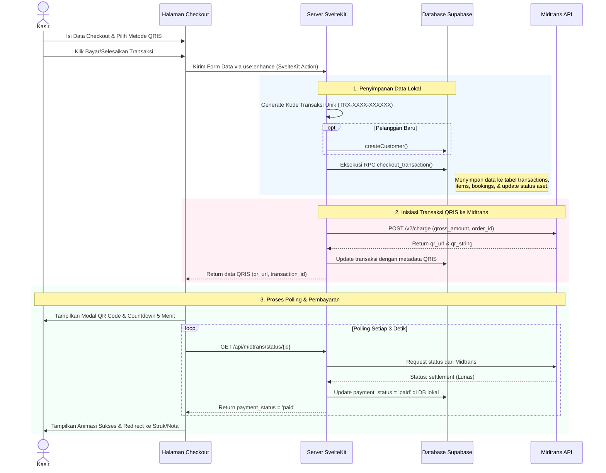
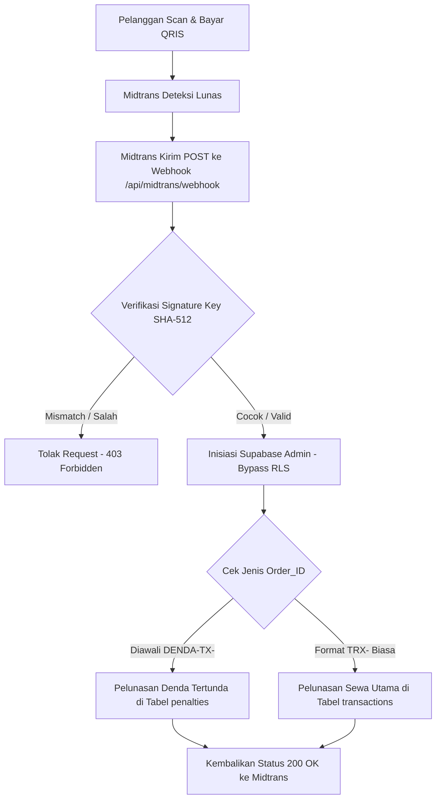

# Dokumentasi POS (Point of Sale) & Integrasi Midtrans QRIS Dinamis

Dokumen ini menjelaskan arsitektur, alur data, dan mekanisme integrasi sistem pembayaran **Midtrans QRIS Dinamis** pada modul **POS (Point of Sale)** dalam proyek BotaniRent.

---

## 🛠️ Arsitektur File & Kode yang Terlibat

Berikut adalah modul-modul penting yang menangani operasional kasir dan sistem pembayaran online di proyek ini:

| Tipe Modul | Nama File & Tautan | Peran / Deskripsi |
| :--- | :--- | :--- |
| **Frontend POS** | [`+page.svelte`](file:///C:/Users/rexzy/botani-app/botanirent-web/src/routes/(app)/pos/+page.svelte) | UI katalog alat outdoor aktif, pengelompokan kategori, pencarian, dan pengelolaan keranjang belanja kasir. |
| **Backend POS Load** | [`+page.server.js`](file:///C:/Users/rexzy/botani-app/botanirent-web/src/routes/(app)/pos/+page.server.js) | Server load function yang memanggil data katalog dan pelanggan secara paralel sebelum halaman POS dirender. |
| **Frontend Checkout** | [`+page.svelte (checkout)`](file:///C:/Users/rexzy/botani-app/botanirent-web/src/routes/(app)/pos/checkout/+page.svelte) | Halaman konfirmasi pembayaran. Berfungsi menentukan pelanggan, durasi sewa, jaminan, input bayar tunai, dan modal scan QRIS. |
| **Backend Checkout Link** | [`+page.server.js (checkout)`](file:///C:/Users/rexzy/botani-app/botanirent-web/src/routes/(app)/pos/checkout/+page.server.js) | Menangani SvelteKit Form Actions saat kasir menekan tombol "Bayar/Selesaikan Transaksi". |
| **POS Controller** | [`posController.js`](file:///C:/Users/rexzy/botani-app/botanirent-web/src/lib/server/controllers/posController.js) | Logika bisnis inti. Mengatur flow database lokal dan melakukan pemanggilan HTTP request ke API Midtrans. |
| **API Cek Status (Proxy)** | [`+server.js (status)`](file:///C:/Users/rexzy/botani-app/botanirent-web/src/routes/api/midtrans/status/[id]/+server.js) | Endpoint yang dipolling secara berkala oleh frontend untuk mendeteksi perubahan status lunas pada transaksi/denda tertentu. |
| **API Webhook Midtrans** | [`+server.js (webhook)`](file:///C:/Users/rexzy/botani-app/botanirent-web/src/routes/api/midtrans/webhook/+server.js) | Endpoint M2M (Machine-to-Machine) yang menerima dorongan notifikasi lunas secara asinkron langsung dari server Midtrans. |

---

## 🔄 Alur Kerja Modul POS (Step-by-Step)



### 1. Memuat Halaman & Menyusun Keranjang
*   Saat kasir membuka POS, [`+page.server.js`](file:///C:/Users/rexzy/botani-app/botanirent-web/src/routes/(app)/pos/+page.server.js) memanggil fungsi `getPOSData()` di [`posController.js`](file:///C:/Users/rexzy/botani-app/botanirent-web/src/lib/server/controllers/posController.js). Data kategori, barang aktif, paket, dan data pelanggan dimuat menggunakan `Promise.all()` agar query berjalan paralel dan cepat.
*   Kasir memilih barang atau paket bundel yang akan disewa/dibeli. Data ini dikelola oleh *Svelte 5 runes* (`$state`) dan disimpan di browser client menggunakan `sessionStorage` dengan key `botani_cart`.

### 2. Memasuki Halaman Checkout
*   Keranjang dari `sessionStorage` di-load di halaman checkout. Kasir melengkapi data transaksi:
    *   **Tanggal & Durasi Sewa**: Menentukan awal sewa dan otomatis menghitung tanggal pengembalian.
    *   **Identitas Pelanggan**: dropdown untuk pelanggan lama, input form untuk pelanggan baru.
    *   **Jaminan (Guarantee)**: Jenis identitas yang ditinggalkan pelanggan sebagai jaminan (KTP, SIM, dll).
    *   **Metode Pembayaran**: Kasir dapat memilih metode **Tunai** atau **QRIS**.

### 3. Pengolahan Data di Server (Server-Side Safety)
Ketika kasir menekan tombol "Bayar", form checkout disubmit secara asinkron menggunakan `use:enhance` bawaan SvelteKit ke [`+page.server.js (checkout)`](file:///C:/Users/rexzy/botani-app/botanirent-web/src/routes/(app)/pos/checkout/+page.server.js). Server mengeksekusi fungsi `checkout()` pada [`posController.js`](file:///C:/Users/rexzy/botani-app/botanirent-web/src/lib/server/controllers/posController.js):
1.  **Proteksi Server-side**: Kasir ID (`cashier_id`) dan Cabang ID (`branch_id`) di-inject langsung dari session user server untuk mencegah manipulasi cabang oleh staf nakal.
2.  **Pembuatan Kode Nota Unik**: String nota seperti `TRX-[4-karakter-acak]-[6-digit-timestamp]` dibuat secara terpusat di server.
3.  **Pelanggan**: Jika ada nama pelanggan baru, record baru dimasukkan ke tabel `customers`. Jika pelanggan lama memperbarui jaminan, data jaminan di notes JSON diperbarui.
4.  **Eksekusi Database**: Semua entri transaksi (tabel `transactions`, `transaction_items`, dan `bookings`) serta pembaruan status aset diubah secara atomik dalam satu langkah melalui Stored Procedure PostgreSQL/RPC (`checkout_transaction`).

---

## 💳 Mekanisme Integrasi Midtrans QRIS Dinamis

BotaniRent menggunakan jenis **QRIS Dinamis** melalui **Core API Midtrans** (bukan Snap Redirect / Popup). QR Code memiliki nominal yang terkunci secara otomatis sehingga menghindari kesalahan ketik nominal oleh pembeli.

### 1. Inisiasi API `/charge` (Server-to-Midtrans)
Apabila kasir memilih metode QRIS, server akan mengirim HTTP POST ke gateway Midtrans Sandbox (`https://api.sandbox.midtrans.com/v2/charge`) atau Production (`https://api.midtrans.com/v2/charge`):
*   **Autentikasi**: Menggunakan header HTTP Basic Auth dengan skema: `Authorization: Basic Base64(MIDTRANS_SERVER_KEY + ":")`.
*   **Payload parameter**:
    ```json
    {
      "payment_type": "qris",
      "transaction_details": {
        "order_id": "TRX-RANDOM-TIMESTAMP", // Kode transaksi dari BotaniRent
        "gross_amount": 150000 // Total nominal belanja dibulatkan ke rupiah terdekat
      },
      "customer_details": {
        "first_name": "Nama Pelanggan",
        "phone": "0812XXXXXXXX"
      },
      "custom_expiry": {
        "expiry_duration": 5, // Batas waktu pembayaran dibatasi 5 menit
        "unit": "minute"
      }
    }
    ```
*   **Respons**: Midtrans mengembalikan status `201 Created` bersama properti `qr_string` (kumpulan teks standar EMVCo) dan array `actions` yang memuat tautan CDN gambar QR Code (`generate-qr-code`).
*   **Penyimpanan**: Server menyimpan ID Transaksi Midtrans dan informasi QR code ke kolom `midtrans_transaction_id` dan `midtrans_snap_token` di tabel `transactions` lokal, lalu mengirimkannya kembali ke frontend.

### 2. Sinkronisasi Real-Time (Frontend Polling)
Setelah modal QR Code tampil di layar kasir, frontend secara otomatis mengaktifkan polling status:
*   Frontend menjalankan `setInterval` setiap **3 detik** untuk menembak endpoint proxy local: `GET /api/midtrans/status/[id]`.
*   Endpoint server ([`status/[id]/+server.js`](file:///C:/Users/rexzy/botani-app/botanirent-web/src/routes/api/midtrans/status/[id]/+server.js)) akan bertindak sebagai pengaman:
    1.  Memeriksa status di database lokal. Jika di DB sudah `paid`, langsung return lunas (menghemat kuota API Midtrans).
    2.  Jika di DB lokal masih `pending`, server mengirim request ke status resmi Midtrans: `GET /v2/${transaction_code}/status`.
    3.  Apabila status transaksi dari Midtrans adalah `settlement` atau `capture`, server melakukan pembaruan di database lokal (set `payment_status = 'paid'`, set tanggal lunas `paid_at`, dan catat ID pembayaran Midtrans).
*   Begitu respons polling menunjukkan `paid`, frontend menghentikan polling, membersihkan cart, menutup modal, dan mengalihkan halaman ke struk transaksi (`/transactions/[id]?success=true`).

### 3. Pengaman Asinkron (Webhook Endpoint)
Jika kasir tidak sengaja menutup tab browser sebelum pembayaran lunas, sinkronisasi status tetap berjalan secara otomatis di belakang layar menggunakan **Webhook** ([`webhook/+server.js`](file:///C:/Users/rexzy/botani-app/botanirent-web/src/routes/api/midtrans/webhook/+server.js)).



#### **A. Proteksi Spoofing (SHA-512 Verification)**
Midtrans menyertakan properti `signature_key` di setiap webhook payload. Server memverifikasi keaslian pengirim dengan melakukan komputasi hashing SHA-512 lokal menggunakan rumus:
```javascript
const concatenatedString = `${order_id}${status_code}${gross_amount}${MIDTRANS_SERVER_KEY}`;
const locallyComputedHash = crypto
    .createHash('sha512')
    .update(concatenatedString)
    .digest('hex');
```
Jika `locallyComputedHash` tidak sama dengan `signature_key` dari Midtrans, permintaan akan langsung ditolak dengan status `403 Forbidden`.

#### **B. Bypass RLS dengan Service Role Key**
Karena webhook dipicu langsung oleh server Midtrans secara M2M (Machine-to-Machine), server pemanggil tidak memiliki session login staf di sistem. Oleh karena itu, server menggunakan **Service Role Key** rahasia untuk membuat client administrator Supabase (`supabaseAdmin`). Hal ini mengizinkan sistem untuk memperbarui database secara asinkron dengan melompati batasan keamanan RLS (*Row Level Security*).

#### **C. Pencatatan Jenis Pembayaran Webhook**
*   **Kasus Pembayaran Denda (`DENDA-TX-[UUID]`)**: Jika `order_id` diawali string denda, server memotong prefix tersebut untuk mendapatkan ID transaksi utama, memetakan denda dari item-item sewa, lalu mengubah status di tabel `penalties` menjadi `paid`.
*   **Kasus Transaksi POS Biasa**: Server mencocokkan `transaction_code` dengan `order_id`, lalu memperbarui status pembayaran di tabel `transactions` menjadi `paid` serta menyimpan `paid_at` dan `midtrans_transaction_id` pembayaran.
*   **Kasus Gagal**: Jika status pembayaran yang dikirim adalah `expire` (kedaluwarsa), `cancel` (dibatalkan), atau `deny` (ditolak), sistem akan menandai status pembayaran di DB lokal menjadi `failed`.
