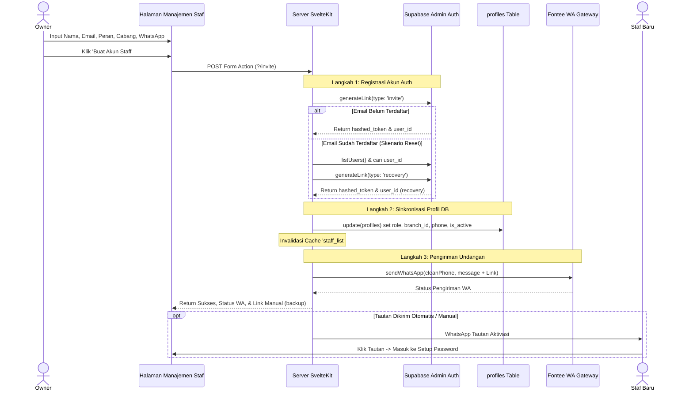

# Dokumentasi Manajemen Staf (Staff Management)

Dokumen ini menjelaskan arsitektur keamanan, logika bisnis, dan mekanisme penambahan staf baru serta penonaktifan staf pada aplikasi BotaniRent.

---

## 🛠️ Arsitektur File & Kode yang Terlibat

Sistem manajemen staf membatasi hak akses secara ketat dan menggunakan API tingkat tinggi (*Admin/Service Role*) untuk mengelola pengguna.

| Tipe Modul | Nama File & Tautan | Peran / Deskripsi |
| :--- | :--- | :--- |
| **Frontend UI** | [`+page.svelte`](file:///C:/Users/rexzy/botani-app/botanirent-web/src/routes/(app)/staff/+page.svelte) | Menampilkan daftar staf (nama, peran, cabang, status aktif/nonaktif) dan modal formulir tambah staf baru. |
| **Backend & Actions** | [`+page.server.js`](file:///C:/Users/rexzy/botani-app/botanirent-web/src/routes/(app)/staff/+page.server.js) | Pengendali otorisasi (Owner-only guard), penghasil tautan otentikasi via Admin API, pemicu notifikasi WhatsApp Fontee, dan pembaruan database. |
| **Admin Supabase Client** | [`supabase.js`](file:///C:/Users/rexzy/botani-app/botanirent-web/src/lib/server/supabase.js) | Inisialisasi client admin menggunakan `SERVICE_ROLE_KEY` privat untuk bypass RLS dan mengelola user di skema internal auth. |
| **WhatsApp Service** | [`fontee.js`](file:///C:/Users/rexzy/botani-app/botanirent-web/src/lib/server/fontee.js) | Modul integrasi API gateway pihak ketiga (Fontee) untuk mengirimkan pesan WhatsApp otomatis. |

---

## 🔑 Otorisasi Akses (Security Guard)
Sebelum server memuat data (*load*) atau menjalankan tindakan formulir (*form actions*), sistem akan mengecek peran pengguna:
```javascript
if (profile?.role !== 'owner') {
    throw error(403, 'Akses ditolak. Hanya Owner yang dapat mengakses halaman ini.');
}
```
Hal ini memastikan kasir, admin gudang, atau pengguna biasa tidak dapat memanipulasi daftar staf, melihat data kredensial, ataupun mengubah status aktif akun lain.

---

## ➕ 1. Mekanisme Penambahan (Undang) Staf Baru

Proses penambahan staf dirancang untuk meminimalkan *friction* (gesekan). Kasir/Staf tidak perlu memverifikasi email secara manual; sebagai gantinya, tautan pendaftaran/aktivasi dikirimkan langsung ke nomor WhatsApp mereka.



### Detil Logika Pemrosesan (Action: `invite`)

#### A. Pembuatan Akun di Supabase Auth (`auth.users`)
Server menggunakan Supabase Admin Client untuk membuat tautan pendaftaran instan tanpa memicu pengiriman email default dari Supabase:
1.  **Peluang Baru (Email Belum Terdaftar)**:
    Server memanggil `generateLink` dengan parameter `type: 'invite'`. Supabase akan membuat user baru dan mengembalikan `hashed_token`. Server menyusun tautan aktivasi mandiri:
    `https://[domain]/callback?token_hash=[hashed_token]&type=invite`
2.  **Pencegahan Duplikasi (Email Sudah Terdaftar)**:
    Jika email staf sudah pernah didaftarkan (memicu error `email_exists`), sistem tidak akan gagal. 
    *   Server secara cerdas mencari ID pengguna lama melalui `listUsers()`.
    *   Server membuatkan tautan pemulihan kata sandi (`type: 'recovery'`) secara terprogram:
        `https://[domain]/callback?token_hash=[hashed_token]&type=recovery`
    *   Staf lama tetap mendapat tautan WhatsApp untuk mengatur ulang sandi dan mengaktifkan kembali akun mereka dengan peran baru.

#### B. Pembaruan Profil Database (`public.profiles`)
Setelah akun autentikasi siap, server memperbarui data profil staf di tabel publik. 
*   **Kolom yang Diperbarui**: `full_name`, `role`, `branch_id`, `phone`, dan mengeset `is_active: true`.
*   **Mekanisme Fallback (Ketahanan Sistem)**:
    Jika skema database belum memiliki kolom `phone` di tabel `profiles`, update pertama akan gagal. Sistem akan menangkap error tersebut, mencoba mengupdate kembali profil staf **tanpa** kolom `phone` agar akun tetap berhasil terbuat, lalu menampilkan notifikasi peringatan (`dbWarning`) di dashboard Owner.

#### C. Integrasi WhatsApp Fontee
Tautan aktivasi/pemulihan yang telah dibuat dikirimkan ke nomor WhatsApp staf yang terdaftar melalui integrasi **Fontee API Gateway**:
*   Sistem menyaring nomor telepon untuk memastikan formatnya bersih dari karakter non-angka (`cleanPhone`).
*   Pesan yang dikirimkan berisi salam, peran penempatan kerja, cabang penugasan, dan tautan aktivasi password.
*   **Sistem Cadangan**: Jika pengiriman WhatsApp otomatis gagal (misal: API limit atau nomor WA tidak aktif), status kegagalan (`waSuccess: false`) akan dikembalikan ke UI. Owner akan diperlihatkan tautan pendaftaran tersebut di layar sehingga Owner bisa menyalin dan mengirimkannya secara manual.

---

## 🚫 2. Mekanisme Penaktifan & Penonaktifan Staf

Owner dapat mencabut atau memberikan kembali hak akses masuk staf secara real-time melalui tombol toggle di daftar staf.

### Detil Logika Pemrosesan (Action: `updateStatus`)
Ketika tombol "Nonaktifkan" atau "Aktifkan" diklik, form action `updateStatus` dijalankan di sisi server:

1.  **Proteksi Lockout (Cegah Kunci Diri Sendiri)**:
    Sistem menerapkan proteksi kritis agar Owner tidak dapat menonaktifkan akunnya sendiri secara tidak sengaja:
    ```javascript
    if (id === currentUser.id) {
        return fail(400, { error: 'Anda tidak dapat menonaktifkan akun Anda sendiri.' });
    }
    ```
    Jika hal ini dibiarkan, sistem akan mengalami kegagalan fatal di mana tidak akan ada lagi admin/owner yang bisa masuk ke dashboard manajemen untuk mengelola sistem.
2.  **Pembaruan Status Database**:
    Kolom `is_active` staf bersangkutan pada tabel `profiles` diubah menjadi `false` (untuk penonaktifan) atau `true` (untuk aktivasi).
3.  **Efek Nonaktif**:
    Saat `is_active` diset menjadi `false`, staf tersebut akan langsung ditolak saat mencoba login atau dialihkan keluar jika sedang aktif menggunakan aplikasi karena session login memvalidasi status `is_active` profil di setiap *load* halaman.

---

## ⚡ 3. Sinkronisasi Data & Cache Invalidation
Untuk mengurangi latensi database dari query yang berulang-ulang, daftar staf aktif di-cache selama 15 detik. 

Setelah aksi `invite` atau `updateStatus` selesai diproses secara sukses di server, server akan memanggil fungsi invalidasi cache:
```javascript
cacheInvalidate('staff_list');
cacheInvalidatePrefix('staff_count_');
```
Hal ini memastikan bahwa begitu Owner menambah staf atau menonaktifkan staf, cache akan segera dihancurkan, memaksa server mengambil data paling segar dari database pada request berikutnya, dan perubahan status langsung terlihat di layar tanpa perlu reload paksa.
