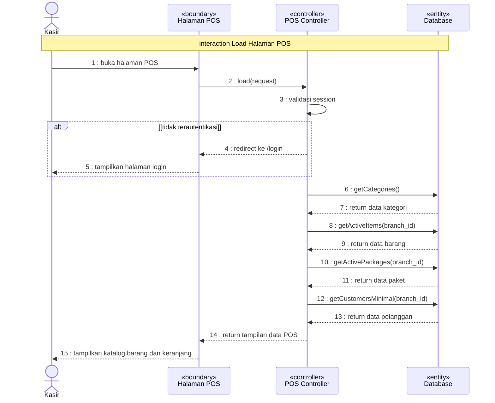
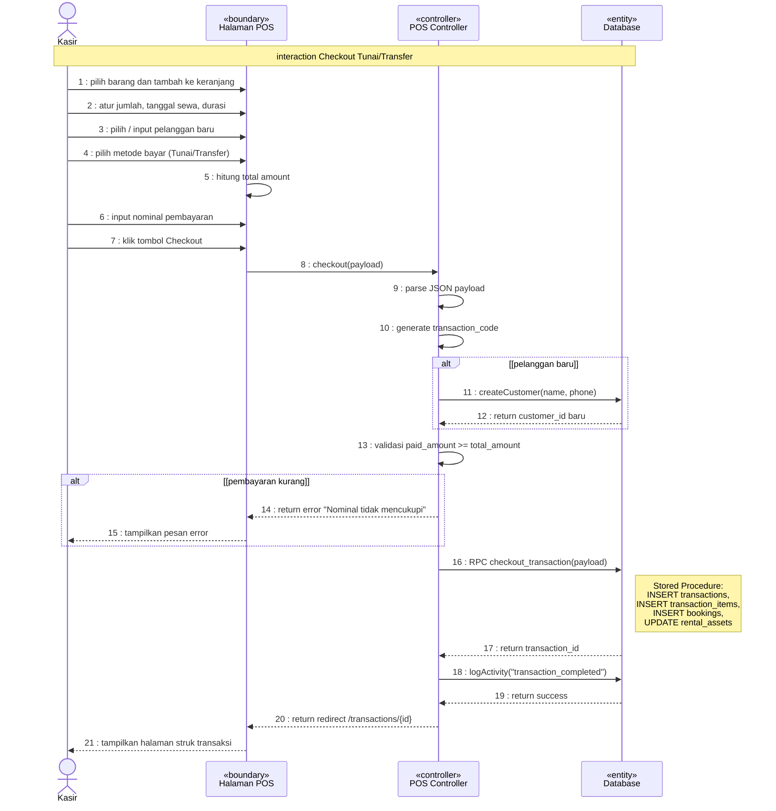
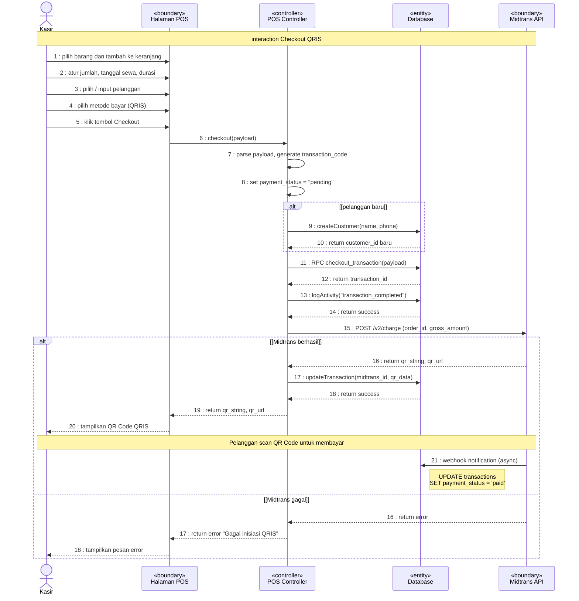

# Sequence Diagram — POS Checkout (Transaksi Penyewaan)

> Dibuat berdasarkan format UML Sequence Diagram sesuai [Materi Sequence Collaboration Diagram.pdf](file:///c:/Users/rexzy/botani-app/botanirent-web/Materi%20Sequence%20Collaboration%20Diagram.pdf)

---

## Komponen Diagram

| No | Stereotype | Nama | Keterangan |
|----|------------|------|------------|
| 1 | **Actor** | Kasir | Staff/Admin yang mengoperasikan POS |
| 2 | **«boundary»** | Halaman POS | Antarmuka UI ([+page.svelte](file:///c:/Users/rexzy/botani-app/botanirent-web/src/routes/(app)/pos/+page.svelte)) |
| 3 | **«controller»** | POS Controller | Logic bisnis checkout ([posController.js](file:///c:/Users/rexzy/botani-app/botanirent-web/src/lib/server/controllers/posController.js)) |
| 4 | **«entity»** | Database | Supabase PostgreSQL (tabel: transactions, transaction_items, customers, bookings) |
| 5 | **«boundary»** | Midtrans API | Sistem pembayaran QRIS eksternal |

---

## Diagram 1: Load Halaman POS

---

## Diagram 2: Proses Checkout (Pembayaran Tunai/Transfer)

---

## Diagram 3: Proses Checkout (Pembayaran QRIS via Midtrans)

---

## Keterangan Notasi

Berdasarkan materi ADSI 2025:

| Notasi | Deskripsi |
|--------|-----------|
| **→** (panah solid / filled arrowhead) | **Synchronous message** — pengirim menunggu pesan ditangani sebelum melanjutkan (pemanggilan method) |
| **-->>** (panah putus-putus / dashed) | **Return message** — penerima selesai memproses dan mengembalikan kendali ke pemanggil |
| **→ ke diri sendiri** (self-loop) | **Message to Self** — objek memproses sesuatu secara internal |
| **alt [kondisi]** | **Fragment alternatif** — skenario bercabang berdasarkan kondisi |
| **«boundary»** | Antarmuka/UI yang berinteraksi dengan actor |
| **«controller»** | Logic sistem yang memproses bisnis |
| **«entity»** | Objek data / database |

---

## Deskripsi Message

### Diagram 1 — Load Halaman POS
| No | Message | Tipe |
|----|---------|------|
| 1 | buka halaman POS | Synchronous |
| 2 | load(request) | Synchronous |
| 3 | validasi session | Message to Self |
| 4–5 | redirect ke /login | Return (alt) |
| 6–13 | query data kategori, barang, paket, pelanggan | Synchronous + Return |
| 14 | return tampilan data POS | Return |
| 15 | tampilkan katalog barang dan keranjang | Return |

### Diagram 2 — Checkout Tunai/Transfer
| No | Message | Tipe |
|----|---------|------|
| 1–7 | interaksi kasir dengan UI | Synchronous |
| 5 | hitung total amount | Message to Self |
| 8 | checkout(payload) | Synchronous |
| 9–10 | parse + generate code | Message to Self |
| 11–12 | createCustomer | Synchronous + Return (alt) |
| 13 | validasi pembayaran | Message to Self |
| 14–15 | error pembayaran kurang | Return (alt) |
| 16–17 | RPC checkout_transaction | Synchronous + Return |
| 18–19 | logActivity | Synchronous + Return |
| 20–21 | redirect ke struk | Return |

### Diagram 3 — Checkout QRIS
| No | Message | Tipe |
|----|---------|------|
| 1–5 | interaksi kasir dengan UI | Synchronous |
| 6 | checkout(payload) | Synchronous |
| 7–8 | parse + set pending | Message to Self |
| 9–10 | createCustomer | Synchronous + Return (alt) |
| 11–14 | simpan transaksi + log | Synchronous + Return |
| 15 | POST /v2/charge ke Midtrans | Synchronous |
| 16–20 | return QR Code (sukses) | Return |
| 21 | webhook notification | **Asynchronous** |
| 16–18 | return error (gagal) | Return (alt) |

---

## File Source Code yang Terlibat

| Layer | File |
|---|---|
| **Boundary (UI)** | [+page.svelte](file:///c:/Users/rexzy/botani-app/botanirent-web/src/routes/(app)/pos/+page.svelte) |
| **Controller (Server)** | [+page.server.js](file:///c:/Users/rexzy/botani-app/botanirent-web/src/routes/(app)/pos/+page.server.js) → [posController.js](file:///c:/Users/rexzy/botani-app/botanirent-web/src/lib/server/controllers/posController.js) |
| **Entity (Model)** | [transactionModel.js](file:///c:/Users/rexzy/botani-app/botanirent-web/src/lib/server/models/transactionModel.js), [customerModel.js](file:///c:/Users/rexzy/botani-app/botanirent-web/src/lib/server/models/customerModel.js) |
| **Database** | Supabase PostgreSQL — RPC: `checkout_transaction` |
| **External** | [Midtrans API](file:///c:/Users/rexzy/botani-app/botanirent-web/src/routes/api/midtrans) — Payment Gateway QRIS |
